# Linux Filesystem Hierarchy — A Deep Dive


> Ever wondered why Linux has no `C:\` drive? Why `/bin` is a symlink to `/usr/bin`? What's actually inside `/dev` — and why your mouse shows up as a file? Why `/proc` exists on disk but has zero size? Why `/var` can silently kill your server?

**You're about to find out.**

---

## What Is the Linux Filesystem Hierarchy?

Unlike Windows which uses drive letters (`C:\`, `D:\`), Linux has a **single unified directory tree** starting at `/` (root). Every partition, every USB drive, every network share — everything is attached somewhere inside this one tree.

The layout follows the **FHS (Filesystem Hierarchy Standard)**, maintained by the Linux Foundation. Think of it as city zoning: each area has a clear purpose, consistent across every Linux distribution.

```
/                   ← the city itself (root of everything)
├── bin  → usr/bin  ← essential user commands
├── sbin → usr/sbin ← essential system commands
├── lib  → usr/lib  ← essential libraries
├── boot            ← kernel + bootloader
├── dev             ← hardware as files
├── etc             ← system configuration
├── home            ← user personal directories
├── lost+found      ← filesystem recovery
├── media           ← auto-mounted removable devices
├── mnt             ← manual mount point
├── opt             ← third-party software
├── proc            ← kernel/process live info (virtual)
├── root            ← root user's home
├── run             ← runtime data (RAM-based)
├── srv             ← service data
├── snap            ← snap packages
├── sys             ← hardware/driver tree (virtual)
├── tmp             ← temporary files (cleared on reboot)
├── usr             ← secondary hierarchy (most software)
└── var             ← variable data (logs, caches, DBs)
```

---

## Section 1 — ls -la / (The Root Filesystem Live)

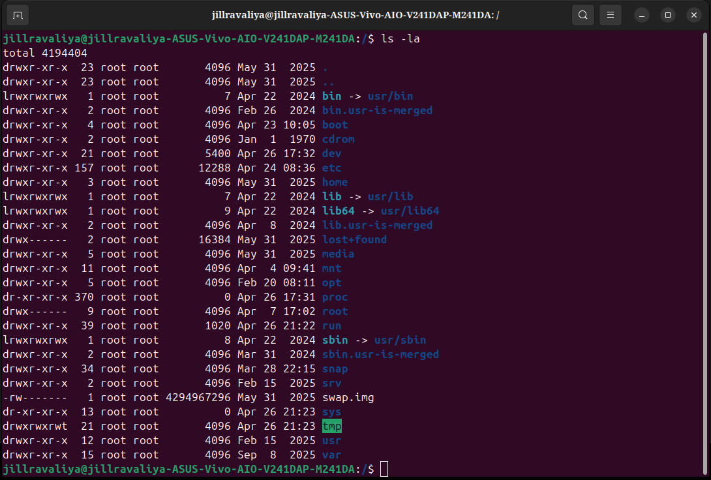

```
total 4194404
drwxr-xr-x  23  root root       4096  May 31  2025  .
drwxr-xr-x  23  root root       4096  May 31  2025  ..
lrwxrwxrwx   1  root root          7  Apr 22  2024  bin -> usr/bin
drwxr-xr-x   2  root root       4096  Feb 26  2024  bin.usr-is-merged
drwxr-xr-x   4  root root       4096  Apr 23 10:05  boot
drwxr-xr-x   2  root root       4096  Jan  1  1970  cdrom
drwxr-xr-x  21  root root       5400  Apr 26 17:32  dev
drwxr-xr-x 157  root root      12288  Apr 24 08:36  etc
drwxr-xr-x   3  root root       4096  May 31  2025  home
lrwxrwxrwx   1  root root          7  Apr 22  2024  lib -> usr/lib
lrwxrwxrwx   1  root root          9  Apr 22  2024  lib64 -> usr/lib64
drwxr-xr-x   2  root root       4096  Apr  8  2024  lib.usr-is-merged
drwx------   2  root root      16384  May 31  2025  lost+found
drwxr-xr-x   5  root root       4096  May 31  2025  media
drwxr-xr-x  11  root root       4096  Apr  4 09:41  mnt
drwxr-xr-x   5  root root       4096  Feb 20 08:11  opt
dr-xr-xr-x 370  root root          0  Apr 26 17:31  proc
drwx------   9  root root       4096  Apr  7 17:02  root
drwxr-xr-x  39  root root       1020  Apr 26 21:22  run
lrwxrwxrwx   1  root root          8  Apr 22  2024  sbin -> usr/sbin
drwxr-xr-x   2  root root       4096  Mar 31  2024  sbin.usr-is-merged
drwxr-xr-x  34  root root       4096  Mar 28 22:15  snap
drwxr-xr-x   2  root root       4096  Feb 15  2025  srv
-rw-------   1  root root 4294967296  May 31  2025  swap.img
dr-xr-xr-x  13  root root          0  Apr 26 21:23  sys
drwxrwxrwt  21  root root       4096  Apr 26 21:23  tmp
drwxr-xr-x  12  root root       4096  Feb 15  2025  usr
drwxr-xr-x  15  root root       4096  Sep  8  2025  var
```

---

### total 4194404 — What This Number Means

```
4194404 blocks × 512 bytes = 2,147,534,848 bytes ≈ 2 GB

But wait — that can't be the real disk usage of / which is much bigger.
Why? Because ls -la of / only counts the directory entries themselves,
not the contents of subdirectories. It's counting metadata, not data.

The real eye-catcher: swap.img = 4294967296 bytes = exactly 4 GB
That single file dominates the total block count.
```

---

### Reading Every Column

```
drwxr-xr-x  157  root  root  12288  Apr 24 08:36  etc
│             │   │     │     │      │              │
│             │   │     │     │      │              └── directory name
│             │   │     │     │      └── last modified date
│             │   │     │     └── size in bytes (4096 = one disk block)
│             │   │     └── group owner
│             │   └── user owner
│             └── hard link count (for dirs: number of subdirectories + 2)
└── permissions: d=dir, rwx for owner/group/others
```

**Hard link count for directories** — why `etc` shows 157:
```
Each subdirectory inside /etc adds 1 to the count.
/etc has 157 hard links = /etc itself + .. from subdirs + files
157 is large because /etc is the most populated config directory on the system.
```

---

### The Symlinks — Modern Linux Merge

The most striking thing in this output: `bin`, `lib`, `lib64`, and `sbin` are all **symlinks**:

```
lrwxrwxrwx  bin  -> usr/bin       (7 bytes = length of "usr/bin")
lrwxrwxrwx  lib  -> usr/lib       (7 bytes)
lrwxrwxrwx  lib64 -> usr/lib64    (9 bytes)
lrwxrwxrwx  sbin -> usr/sbin      (8 bytes)
```

**And there are companion directories explaining why:**
```
drwxr-xr-x  bin.usr-is-merged    ← marker: bin has been merged into usr
drwxr-xr-x  lib.usr-is-merged    ← marker: lib has been merged into usr
drwxr-xr-x  sbin.usr-is-merged   ← marker: sbin has been merged into usr
```

These `*.usr-is-merged` directories are **sentinel directories** — they're empty and exist only to tell package managers and system tools "this system has completed the usr-merge." Tools like `dpkg` check for their existence before deciding where to place files.

**Why the merge happened:**
```
Historical Linux:
  / = tiny partition (survival tools: /bin, /sbin, /lib)
  /usr = large partition (all software)
  /usr could be on a SEPARATE DISK, mounted after boot

Modern Linux:
  / and /usr on same partition = no reason to split
  /bin → /usr/bin  (symlink)
  Package managers now only deal with /usr/bin
  Simpler, cleaner, one source of truth

The *.usr-is-merged directories appeared in Ubuntu ~22.04
They exist in /bin.usr-is-merged, /lib.usr-is-merged, /sbin.usr-is-merged
```

---

### swap.img — 4,294,967,296 bytes

```
-rw-------  1  root  root  4294967296  May 31  2025  swap.img
```

Exactly 4 GB. Permissions `-rw-------` = root-only (extremely sensitive — contains RAM contents).

**What swap is:**
```
When RAM is full:
  Kernel moves least-recently-used pages from RAM → swap.img
  Now RAM has space for new data
  If that old data is needed: kernel moves it back from swap → RAM
  This is called "swapping" or "paging"

swap.img on your machine:
  Type: swap FILE (not swap partition)
  Size: 4 GB
  Location: on root filesystem
  Permission: root-only (contains memory contents = sensitive!)

Alternative: swap partition
  /dev/nvme0n1p3 as swap partition
  Slightly faster (no filesystem overhead)
  But less flexible (can't resize easily)

Modern approach (your machine):
  swap.img file = easier to manage
  Can resize: sudo swapoff /swap.img → resize → sudo swapon /swap.img
```

---

### cdrom — Jan 1 1970

```
drwxr-xr-x  2  root  root  4096  Jan  1  1970  cdrom
```

Empty directory dated epoch zero. Your machine has no optical drive, but this directory exists as a legacy mount point. The 1970 date means it was never touched after creation — the filesystem formatted date was inherited from epoch zero.

---

### proc and sys — Zero Size Directories

```
dr-xr-xr-x  370  root  root  0  Apr 26 17:31  proc
dr-xr-xr-x   13  root  root  0  Apr 26 21:23  sys
```

**Size = 0** — these are **virtual filesystems**. They don't occupy any disk space because they don't live on disk. The kernel generates their contents in RAM on demand, every time you read from them.

**`proc` has 370 hard links** — that's the number of PIDs (running processes) at the time of the `ls` command, each contributing a subdirectory.

**Permissions `dr-xr-xr-x`** — everyone can read and enter, but nobody can write (the kernel controls what appears here, not users).

---

### run — 1020 bytes

```
drwxr-xr-x  39  root  root  1020  Apr 26 21:22  run
```

1020 bytes for the directory entry — `run` has 39 entries. It's a `tmpfs` (RAM-based filesystem), cleared at every boot, repopulated by services as they start.

---

### tmp — drwxrwxrwt

```
drwxrwxrwt  21  root  root  4096  Apr 26 21:23  tmp
```

The `t` at the end of permissions = **sticky bit**. This means:
```
rwxrwxrwt:
  Everyone can read, write, execute (rwxrwx)
  BUT: sticky bit (t) = you can only DELETE your own files
  
Without sticky bit (rwxrwxrwx):
  User A creates /tmp/myfile
  User B can DELETE /tmp/myfile (dangerous!)

With sticky bit (rwxrwxrwt):
  User A creates /tmp/myfile
  User B CANNOT delete it (only A and root can)

This is why /tmp is safe for multi-user systems.
```

---

### root — drwx------

```
drwx------  9  root  root  4096  Apr  7 17:02  root
```

`700` permissions — **root user's home directory, completely private**. Not even other users can peek inside.

---

## Section 2 — /bin (Live Output)

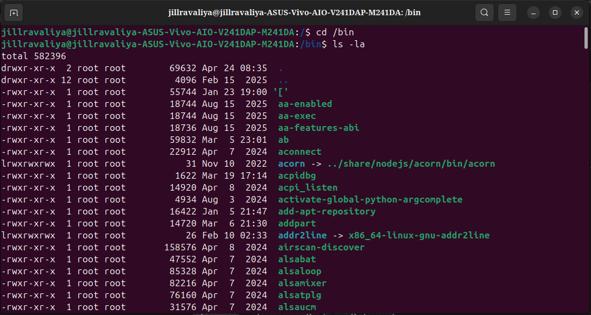

```
jillravaliya@...:/$ cd /bin
jillravaliya@...:/bin$ ls -la

total 582396
drwxr-xr-x   2  root root   69632  Apr 24 08:35  .
drwxr-xr-x  12  root root    4096  Feb 15  2025  ..
-rwxr-xr-x   1  root root   55744  Jan 23 19:00  '['
-rwxr-xr-x   1  root root   18744  Aug 15  2025  aa-enabled
-rwxr-xr-x   1  root root   18744  Aug 15  2025  aa-exec
-rwxr-xr-x   1  root root   18736  Aug 15  2025  aa-features-abi
-rwxr-xr-x   1  root root   59832  Mar  5 23:01  ab
-rwxr-xr-x   1  root root   22912  Apr  7  2024  aconnect
lrwxrwxrwx   1  root root      31  Nov 10  2022  acorn -> ../share/nodejs/acorn/bin/acorn
...
```

### total 582396 — /bin is Huge

```
582396 blocks × 512 = 298,186,752 bytes ≈ 284 MB

Remember: /bin IS /usr/bin (symlink)
So 284 MB = the entire userspace command set on your machine
Every command you ever run from the terminal lives here
```

### The dot directory size — 69632 bytes

```
drwxr-xr-x  2  root root  69632  Apr 24 08:35  .
```

The `.` (current directory) is **69,632 bytes = 68 KB** just for the directory entry itself. This means `/bin` contains so many files that their filenames alone fill 68 KB of directory metadata. This is a massive number of binaries.

### `'['` — The Command With Brackets

```
-rwxr-xr-x  1  root root  55744  Jan 23 19:00  '['
```

This is the **`[` command** — the test command used in shell scripts. When you write `if [ -f file ]` in bash, the `[` is actually calling this binary. The quotes in the listing are because `[` would confuse the shell without them. It's a real 55KB executable.

### `aa-enabled`, `aa-exec`, `aa-features-abi` — AppArmor

```
-rwxr-xr-x  18744  aa-enabled       ← check if AppArmor is enabled
-rwxr-xr-x  18744  aa-exec          ← execute program under AppArmor profile
-rwxr-xr-x  18736  aa-features-abi  ← check AppArmor ABI features
```

AppArmor = Mandatory Access Control system. These three binaries have nearly identical sizes (18744, 18744, 18736) — likely compiled from the same codebase with minor differences.

### `acorn -> ../share/nodejs/acorn/bin/acorn`

```
lrwxrwxrwx  1  root root  31  Nov 10  2022  acorn -> ../share/nodejs/acorn/bin/acorn
```

A symlink inside `/bin` pointing to a Node.js package. The actual code lives in `/usr/share/nodejs/acorn/bin/acorn`. This is how npm global packages appear in your PATH — the binary lives in `/usr/share`, but a symlink in `/usr/bin` (which is `/bin`) makes it callable directly.

### /bin Permissions Pattern

```
-rwxr-xr-x = 755: owner can read/write/execute, group and others can read/execute

Why 755 for all binaries?
  Execute bit for owner: root can run them
  Execute bit for group/others: ALL users can run them
  This is essential — regular users need ls, cp, bash, etc.

Write only for owner (root):
  Users cannot modify system binaries
  Security: prevents tampering with ls, cp, bash
```

---

## What is /bin?

`/bin` = **binary executables for everyone**. The essential programs that ALL users need, including during single-user rescue mode.

```
Core tools you use every day — all live here:
  ls        → list directory contents
  cp        → copy files/directories
  mv        → move/rename files
  rm        → remove files
  cat       → display file contents
  echo      → print text
  pwd       → print working directory
  chmod     → change file permissions
  chown     → change file ownership
  bash      → the shell itself
  grep      → search text patterns
  find      → find files
  tar       → archive files
  gzip      → compress files
  mount     → mount filesystems
  df        → disk space usage
  du        → directory space usage
  ps        → running processes
  kill      → send signals to processes
  date      → show/set system date
  mkdir     → make directory
  ln        → create links
```

**Why /bin must be small and self-contained:**
```
Imagine your system breaks. /usr is on a corrupted partition.
You enter single-user recovery mode (only root shell, no GUI, no /usr).

You still need:
  ls   → to see what files exist
  cp   → to copy backup configs
  rm   → to delete corrupted files
  bash → to run commands at all
  mount → to try mounting other partitions

All of these MUST be in / (not in /usr) for recovery to work.
That's the historical reason for /bin's existence at the root level.
Today /bin = /usr/bin via symlink, but the concept holds.
```

---

## Section 3 — /sbin (Live Output)

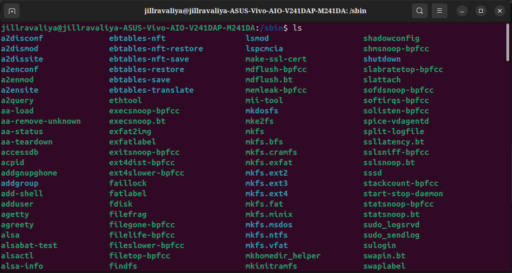

```
jillravaliya@...:/sbin$ ls

a2disconf      ebtables-nft          lsmod          shadowconfig
a2dismod       ebtables-nft-restore  lspcmcia       shmsnoop-bpfcc
a2dissite      ebtables-nft-save     make-ssl-cert  shutdown
a2enconf       ebtables-restore      mdflush-bpfcc  slabratetop-bpfcc
a2enmod        ebtables-save         mdflush.bt     slattach
a2ensite       ebtables-translate    memleak-bpfcc  softdsnoop-bpfcc
a2query        ethtool               mii-tool       softirqs-bpfcc
aa-load        execsnoop-bpfcc       mkdosfs        solisten-bpfcc
aa-remove-unknown execsnoop.bt       mke2fs         spice-vdagentd
aa-status      exfat2img             mkfs           split-logfile
aa-teardown    exfatlabel            mkfs.bfs       ssllatency.bt
accessdb       exitsnoop-bpfcc       mkfs.cramfs    sslsniff-bpfcc
acpid          ext4dist-bpfcc        mkfs.exfat     sslsnoop.bt
addgnupghome   ext4slower-bpfcc      mkfs.ext2      sssd
addgroup       faillock              mkfs.ext3      stackcount-bpfcc
add-shell      fatlabel              mkfs.ext4      start-stop-daemon
adduser        fdisk                 mkfs.fat       statsnoop-bpfcc
agetty         filefrag              mkfs.minix     statsnoop.bt
agreety        filegone-bpfcc        mkfs.msdos     sudo_logsrvd
alsa           filelife-bpfcc        mkfs.ntfs      sudo_sendlog
alsabat-test   fileslower-bpfcc      mkfs.vfat      sulogin
alsactl        filetop-bpfcc         mkhomedir_helper shutdown
alsa-info      findfs                mkinitramfs    swapin.bt
...
```

### What /sbin Reveals About Your Machine

Reading the `/sbin` contents tells you exactly what this machine is set up to do:

```
Apache web server tools:
  a2disconf, a2dismod, a2dissite    ← disable apache configs/modules/sites
  a2enconf, a2enmod, a2ensite      ← enable apache configs/modules/sites
  a2query                           ← query apache config state

This machine runs Apache! (apache2 web server installed)

BPF/eBPF tracing tools (entire category):
  execsnoop-bpfcc    ← trace every exec() call system-wide
  exitsnoop-bpfcc    ← trace every process exit
  filetop-bpfcc      ← top-like view of file I/O
  memleak-bpfcc      ← detect memory leaks in running processes
  sslsniff-bpfcc     ← sniff SSL/TLS connections (plaintext!)
  stackcount-bpfcc   ← count kernel stack traces

These are advanced Linux performance/debugging tools
BCC = BPF Compiler Collection. Requires kernel 4.1+

Filesystem creation tools:
  mke2fs             ← create ext2/ext3/ext4 filesystem
  mkfs               ← generic filesystem creator
  mkfs.ext2/3/4      ← format as ext2/3/4
  mkfs.exfat         ← format as exFAT (USB drives)
  mkfs.ntfs          ← format as NTFS (Windows compatibility)
  mkfs.fat/vfat      ← format as FAT32 (UEFI, USB)
  mkdosfs            ← DOS filesystem creator

Network tools:
  ethtool            ← query/control network driver settings
  mii-tool           ← manage network interface media
  ebtables-*         ← Ethernet bridge firewall rules

System management:
  fdisk              ← partition table manipulation
  shutdown           ← power off/reboot system
  adduser/addgroup   ← create users/groups
  mkinitramfs        ← rebuild initrd (critical for boot!)
  sulogin            ← single-user login prompt
  agetty             ← terminal login prompt manager
```

### /sbin Permissions Pattern

```
-rwxr-xr-x = 755: same as /bin

Wait — if it's for root only, why is it world-readable/executable?

Answer: "For root" means conceptually — root is who SHOULD use these.
But technically, many tools need execute permission to work
(setuid tools, tools that check permissions internally).

Some tools DO restrict via setuid:
  -rwsr-xr-x  = setuid bit (s instead of x)
  When any user runs a setuid binary → it runs as root
  Example: sudo, passwd, mount

Regular /sbin tools (like fdisk) without setuid:
  Any user can technically run /sbin/fdisk
  But fdisk needs raw disk access (/dev/sda) → kernel blocks it
  Kernel enforces: only root can open /dev/sda
  So the protection is at the kernel level, not file permissions level
```

---

## What is /sbin?

`/sbin` = **system administration binaries**. Commands for the root user that can change system state in ways that could break things.

```
/bin vs /sbin — the mental model:
  /bin  = a screwdriver, a ruler, a pencil → safe for everyone
  /sbin = a chainsaw, a welding torch, a jackhammer → powerful, risky

Examples:
  /bin/ls    → shows files. Harmless.
  /sbin/fdisk → wrong command = destroyed partition table = data gone
  /bin/cat   → shows content. Harmless.
  /sbin/mkfs → wrong partition = filesystem wiped
  /bin/echo  → prints text. Harmless.
  /sbin/shutdown → takes the whole machine down immediately
```

**The bpfcc tools deserve special attention:**
```
These are eBPF (extended Berkeley Packet Filter) tools.
They hook into the Linux kernel itself and observe everything:

execsnoop-bpfcc:
  Hook: every execve() syscall
  Shows: EVERY program launched on the system, in real-time
  Use: find what's launching processes you didn't start

memleak-bpfcc:
  Hook: kmalloc/kfree and malloc/free
  Shows: memory allocated but never freed
  Use: find memory leaks in running programs WITHOUT restarting them

sslsniff-bpfcc:
  Hook: SSL_write/SSL_read in OpenSSL
  Shows: PLAINTEXT of SSL/TLS connections before encryption
  Use: debug HTTPS traffic on your own machine
  Note: this is why eBPF requires root — enormous power

These are professional-grade Linux performance engineering tools.
They're what engineers at Netflix, Google, Meta use to debug production.
```

---

## Section 4 — /lib (Live Output)

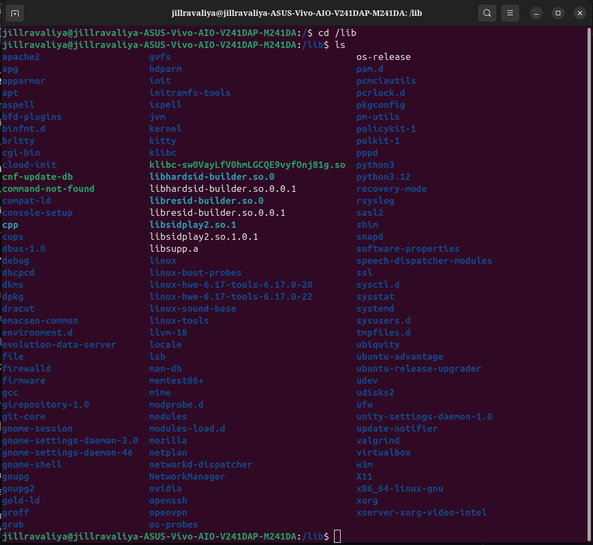

```
jillravaliya@...:/$ cd /lib
jillravaliya@...:/lib$ ls

apache2           gvfs              os-release
apg               hdparm            pam.d
apparmor          init              pcmciautils
apt               initramfs-tools   pcrlock.d
aspell            ispell            pkgconfig
bfd-plugins       jvm               pm-utils
binfmt.d          kernel            policykit-1
brltty            kitty             polkit-1
cgi-bin           klibc             pppd
cloud-init        klibc-sw0VayLfV0hmLGCQE9vyfOnj81g.so
cnf-update-db     libhardsid-builder.so.0
command-not-found libhardsid-builder.so.0.0.1
compat-ld         libresid-builder.so.0
console-setup     libresid-builder.so.0.0.1
cpp               libsidplay2.so.1
cups              libsidplay2.so.1.0.1
dbus-1.0          libsupp.a
debug             linux
dhcpcd            linux-boot-probes
dkms              linux-hwe-6.17-tools-6.17.0-20
dpkg              linux-hwe-6.17-tools-6.17.0-22
dracut            linux-sound-base
emacsen-common    linux-tools
environment.d     llvm-18
evolution-data-server locale
file              lsb
firewalld         man-db
firmware          memtest86+
gcc               mime
girepository-1.0  modprobe.d
git-core          modules
gnome-session     modules-load.d
gnome-settings-daemon-3.0 mozilla
gnome-settings-daemon-46  netplan
gnome-shell       NetworkManager
gnupg             nvidia
gnupg2            openssh
gold-ld           openvpn
groff             os-probes
grub              pam.d
...systemd  sysusers.d  tmpfiles.d  udev  udisks2  ufw
...ubuntu-advantage  ubuntu-release-upgrader
...virtualbox  valgrind  w3m  X11  x86_64-linux-gnu  xorg
...xserver-xorg-video-intel
```

### /lib Reveals Everything Installed

Reading `/lib` is like reading the complete software manifest of the machine:

```
Web & networking:
  apache2       ← Apache web server config data
  NetworkManager ← network connection management
  openssh       ← SSH server/client support
  openvpn       ← VPN software
  firewalld     ← firewall daemon
  netplan       ← Ubuntu network configuration tool

Desktop environment:
  gnome-session        ← GNOME session management
  gnome-shell          ← GNOME shell (the desktop itself)
  gnome-settings-daemon-3.0  ← GNOME settings service
  gnome-settings-daemon-46   ← GNOME 46 settings (newer version!)
  X11                  ← X Window System
  xorg                 ← Xorg display server
  xserver-xorg-video-intel ← Intel GPU Xorg driver

GPU:
  nvidia        ← NVIDIA GPU support files (you have NVIDIA drivers installed!)
  llvm-18       ← LLVM compiler backend (used by AMD Mesa/OpenGL)

Kernel-related:
  dkms                      ← Dynamic Kernel Module Support (recompiles .ko files)
  linux-hwe-6.17-tools-6.17.0-20 ← tools for kernel 6.17.0-20
  linux-hwe-6.17-tools-6.17.0-22 ← tools for kernel 6.17.0-22 (both kernels!)
  modules                   ← kernel module loading infrastructure
  modules-load.d            ← modules to auto-load at boot
  modprobe.d                ← modprobe configuration
  initramfs-tools           ← tools to build initrd.img
  firmware                  ← hardware firmware blobs (WiFi, Bluetooth, etc.)
  dracut                    ← alternative initramfs builder

Security:
  apparmor      ← AppArmor MAC profiles
  pam.d         ← PAM authentication configs
  polkit-1      ← PolicyKit (privilege authorization)
  policykit-1   ← same (version naming)
  udev          ← udev rules and helpers
  ssl           ← SSL/TLS libraries

Virtualization:
  virtualbox    ← VirtualBox guest/host support

Shared library files visible:
  klibc-sw0VayLfV0hmLGCQE9vyfOnj81g.so  ← klibc (used in initramfs)
  libhardsid-builder.so.0                ← SID chip emulation (audio!)
  libresid-builder.so.0                  ← ReSID emulation
  libsidplay2.so.1                       ← SID player library (Commodore 64!)
  libsupp.a                              ← static support library
```

**The klibc filename with random characters explained:**
```
klibc-sw0VayLfV0hmLGCQE9vyfOnj81g.so

The random string = klibc's hash/version identifier
This is intentional — klibc is a minimal C library used in initramfs
The hash ensures: if two versions of klibc coexist, no filename collision
Pattern: klibc-{HASH}.so
```

**Two gnome-settings-daemon versions:**
```
gnome-settings-daemon-3.0   ← legacy API version
gnome-settings-daemon-46    ← GNOME 46 API version

Both can coexist because:
  Some older apps still use the 3.0 API
  New apps use the 46 API
  GNOME maintains both for compatibility
```

---

## What is /lib?

`/lib` = **shared libraries + kernel modules + system service data**.

```
Three types of things live here:

1. Shared library .so files:
   Programs don't carry their own copy of "how to print text"
   Instead they call functions from shared libraries

   Example: /bin/ls doesn't know how to sort text itself
   It calls qsort() from libc.so.6 in /lib/x86_64-linux-gnu/

   Try: ldd /bin/ls
   Output:
     linux-vdso.so.1
     libselinux.so.1  → /lib/x86_64-linux-gnu/libselinux.so.1
     libc.so.6        → /lib/x86_64-linux-gnu/libc.so.6
     /lib64/ld-linux-x86-64.so.2

2. Kernel modules (.ko files):
   /lib/modules/6.17.0-22-generic/
   Drivers that can be loaded/unloaded without rebooting
   Example: plug in USB WiFi → kernel loads rtl8812au.ko

3. Application data/config:
   /lib/systemd/    ← systemd unit files
   /lib/udev/       ← udev rules
   /lib/pam.d/      ← PAM authentication config
   /lib/firmware/   ← hardware firmware blobs
```

**The dynamic linker — the unsung hero:**
```
/lib64/ld-linux-x86-64.so.2

When you run any program:
  Kernel loads the ELF binary into RAM
  Kernel sees: "this program needs shared libraries"
  Kernel runs ld-linux-x86-64.so.2 first
  ld-linux reads the program's dependency list
  ld-linux finds each .so file
  ld-linux maps them into the process's address space
  THEN the program's main() starts executing

Without ld-linux: every program would need to be statically linked
(carry all library code inside itself) → 10x larger binaries
```

---

## Section 5 — /boot (Live Output)

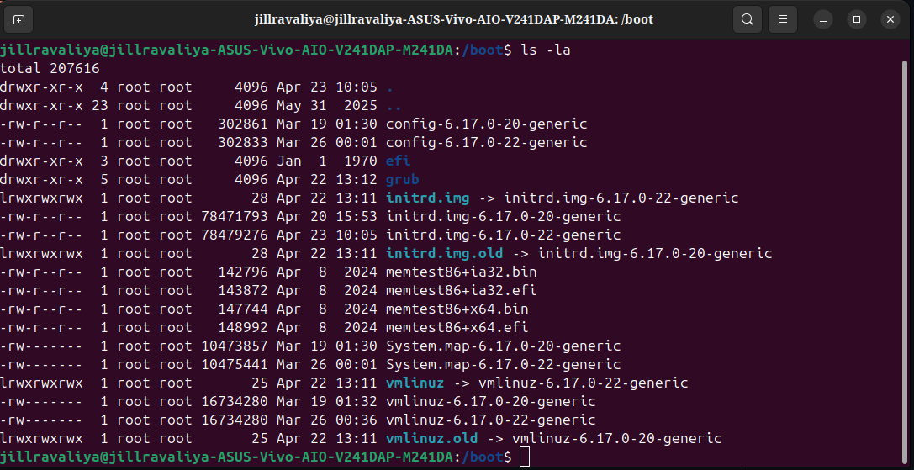

> **See the dedicated `/boot` deep-dive README** for the complete byte-level analysis of every file in this directory. This README is part of the same series.

```
total 207616
-rw-r--r--  config-6.17.0-20-generic    302861  Mar 19 01:30
-rw-r--r--  config-6.17.0-22-generic    302833  Mar 26 00:01
drwxr-xr-x  efi/                          4096  Jan  1  1970
drwxr-xr-x  grub/                         4096  Apr 22 13:12
lrwxrwxrwx  initrd.img → initrd.img-6.17.0-22-generic
-rw-r--r--  initrd.img-6.17.0-20-generic  78471793
-rw-r--r--  initrd.img-6.17.0-22-generic  78479276
lrwxrwxrwx  initrd.img.old → initrd.img-6.17.0-20-generic
-rw-r--r--  memtest86+ia32.bin  -rw-r--r--  memtest86+ia32.efi
-rw-r--r--  memtest86+x64.bin   -rw-r--r--  memtest86+x64.efi
-rw-------  System.map-6.17.0-20-generic  10473857
-rw-------  System.map-6.17.0-22-generic  10475441
lrwxrwxrwx  vmlinuz → vmlinuz-6.17.0-22-generic
-rw-------  vmlinuz-6.17.0-20-generic     16734280
-rw-------  vmlinuz-6.17.0-22-generic     16734280
lrwxrwxrwx  vmlinuz.old → vmlinuz-6.17.0-20-generic
```

Quick summary (full detail in the `/boot` README):

```
vmlinuz-*      ← compressed Linux kernel (~16 MB → ~100 MB in RAM)
initrd.img-*   ← initial RAM disk (mini filesystem with NVMe driver)
System.map-*   ← kernel symbol table (for crash debugging)
config-*       ← kernel build configuration (every yes/no/module decision)
grub/          ← GRUB bootloader config, modules, fonts
efi/           ← EFI System Partition (FAT32 world: shim, GRUB EFI files)
memtest86+*    ← standalone RAM tester (GRUB can boot this instead of Linux)
```

---

## Section 6 — /etc (Live Output)

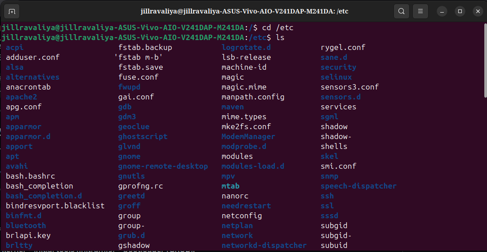

```
jillravaliya@...:/$ cd /etc
jillravaliya@...:/etc$ ls

acpi             fstab.backup    logrotate.d     rygel.conf
adduser.conf     'fstab m-b'     lsb-release     sane.d
alsa             fstab.save      machine-id      security
alternatives     fuse.conf       magic           selinux
anacrontab       fwupd           magic.mime      sensors3.conf
apache2          gai.conf        manpath.config  sensors.d
apg.conf         gdb             maven           services
apm              gdm3            mime.types      sgml
apparmor         geoclue         mke2fs.conf     shadow
apparmor.d       ghostscript     ModemManager    shadow-
apt              glvnd           modprobe.d      shells
avahi            gnome           modules         skel
bash.bashrc      gnome-remote-desktop modules-load.d  smi.conf
bash_completion  gnutls          mpv             snmp
bash_completion.d gprofng.rc     mtab            speech-dispatcher
bindresvport.blacklist greetd    nanorc          ssh
binfmt.d         groff           needrestart     ssl
bluetooth        group           netconfig       sssd
brlapi.key       group-          netplan         subgid
brltty           grub.d          network         subgid-
...              gshadow         networkd-dispatcher subuid
```

### /etc Has 157 Hard Links — The Biggest Config Store

`/etc` has 157 entries (from the root listing). It is the most densely populated directory on the system. Reading it reveals the full software stack:

```
Security & authentication:
  apparmor/        ← AppArmor mandatory access control profiles
  apparmor.d/      ← AppArmor profile directory
  shadow           ← hashed user passwords (root-only readable)
  shadow-          ← backup of shadow (note the dash = backup convention)
  gshadow          ← group shadow passwords
  group, group-    ← group definitions (group- = backup)
  selinux/         ← SELinux config (even if not enabled, config exists)
  security/        ← PAM security limits, access controls
  ssl/             ← SSL certificates and keys
  sssd/            ← SSSD (System Security Services Daemon) for LDAP/AD auth

Boot & filesystem:
  fstab            ← partition mount table (read at boot by systemd)
  fstab.backup     ← backup of fstab (good practice!)
  'fstab m-b'      ← another fstab backup (with space in name — unusual!)
  fstab.save       ← yet another backup
  grub.d/          ← GRUB menu entry scripts (generates /boot/grub/grub.cfg)
  modprobe.d/      ← kernel module loading rules
  modules          ← modules to load at boot
  modules-load.d/  ← systemd-compatible module loading configs

Desktop:
  gnome/           ← GNOME desktop global settings
  gnome-remote-desktop/ ← GNOME remote desktop config
  gdm3/            ← GNOME Display Manager config
  greetd/          ← greeter daemon (alternative display manager)
  skel/            ← skeleton home directory (copied to new user homes)

Networking:
  netplan/         ← Ubuntu's network config (YAML-based)
  network/         ← legacy network scripts
  networkd-dispatcher/ ← networkd event scripts
  ModemManager/    ← mobile modem management
  avahi/           ← mDNS/Bonjour service discovery
  bluetooth/       ← Bluetooth configuration

Services:
  apache2/         ← Apache web server config
  ssh/             ← OpenSSH server config (sshd_config lives here)
  cups/            ← CUPS printing system
  cron*/           ← cron scheduling configs
  systemd/         ← systemd unit overrides (always check /etc/systemd/ first)
  apt/             ← apt package manager config
  dpkg/            ← dpkg package manager config

Interesting oddities:
  machine-id       ← unique ID for this machine instance (128-bit UUID)
                     Used by systemd, D-Bus, journald
                     Generated at install time, survives reboots
                     Changes on cloning (that's how VMs are uniquified)
  lsb-release      ← "Ubuntu 24.04 LTS" etc (readable by scripts)
  os-release       ← systemd-standard OS info file
  magic            ← file type detection rules (used by `file` command)
  magic.mime       ← MIME type detection rules
  shells           ← list of valid login shells (/bin/bash, /bin/zsh, etc.)
  services         ← port → service name mappings (like /etc/hosts for ports)
  bindresvport.blacklist ← ports that shouldn't be bound
```

**The backup files pattern in /etc:**
```
shadow   ← current
shadow-  ← previous (backup before last change)

group    ← current
group-   ← previous

This is a standard pattern: when tools like passwd, useradd, groupadd
modify files, they first copy the current → backup (with - suffix)
then write the new version. If something fails: the - backup is the recovery.

fstab.backup, fstab.save = manual backups someone created.
'fstab m-b' with space = another backup (unusual naming, probably manual).
```

**machine-id — the machine's fingerprint:**
```bash
cat /etc/machine-id
# Output: a64729b4c9f247b9b0c3a5f1e8d3c2a1 (128-bit hex)
```

```
This ID:
  Stays the same across reboots
  Changes if you clone the VM/disk (on first boot after clone)
  Used by:
    systemd → journal log partitioning
    D-Bus   → machine identification
    systemd-networkd → generating consistent interface names
    containers → to identify the host

If two VMs have the same machine-id → journal mixing, D-Bus confusion
Ubuntu auto-regenerates it when cloning is detected
```

---

## What is /etc?

`/etc` = **Editable Text Configuration**. The system's complete rulebook — plain text files that control everything from which partitions to mount to who can log in.

```
Key principle: /etc does NOT enforce anything itself.
/etc is a library of rules.
Other programs READ those rules and enforce them.

/etc/fstab   → systemd reads it → mounts partitions
/etc/passwd  → PAM reads it → decides who can log in
/etc/ssh/sshd_config → sshd reads it → configures SSH
/etc/sudoers → sudo reads it → decides who can use sudo
/etc/hosts   → NSS reads it → resolves hostnames

/etc = the rulebook. Kernel + services = the enforcers.
```

**The most dangerous files in /etc:**
```
/etc/fstab     Wrong entry → system won't mount root → stuck in emergency mode
/etc/sudoers   Wrong syntax → lose sudo access → locked out of admin
/etc/passwd    Corruption → nobody can log in
/etc/shadow    Corruption → all passwords fail
/etc/resolv.conf Wrong DNS → no internet (but DNS tools say "working")
/etc/ssh/sshd_config  Wrong → SSH daemon fails to start → locked out remotely

Best practice before ANY edit:
  sudo cp /etc/someconfig /etc/someconfig.bak
  Then edit
  Then verify syntax (e.g., sudo sshd -t to test ssh config)
```

---

## Section 7 — /dev (Live Output)

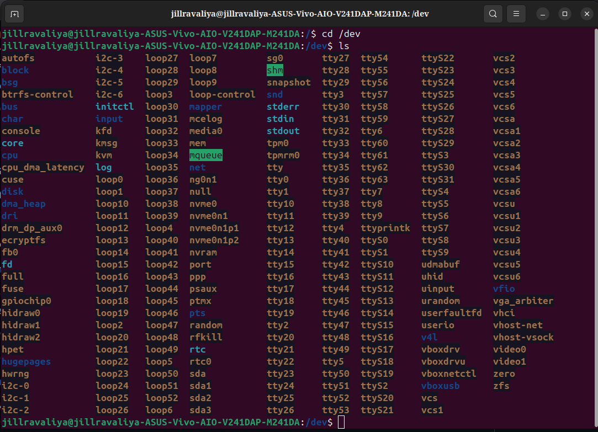

```
jillravaliya@...:/$ cd /dev
jillravaliya@...:/dev$ ls

autofs      i2c-3    loop7        sg0       tty27   ttyS22   vcs2
block       i2c-4    loop27       shm       tty28   ttyS23   vcs3
bsg         i2c-5    loop28       snapshot  tty29   ttyS24   vcs4
btrfs-control i2c-6  loop29      snd       tty3    ttyS25   vcs5
bus         initctl  loop30       stderr    tty30   ttyS26   vcs6
char        input    loop31       stdin     tty31   ttyS27   vcsa
console     kfd      loop32       stdout    tty32   ttyS28   vcsa1
core        kmsg     loop33       tpm0      tty33   ttyS29   vcsa2
cpu         kvm      loop34       tpmrm0    tty34   ttyS3    vcsa3
cpu_dma_latency log  loop35       tty       tty35   ttyS30   vcsa4
cuse        loop0    loop36       tty0      tty36   ttyS31   vcsa5
disk        loop1    loop37       tty1      tty37   ttyS7    vcsa6
dma_heap    loop10   loop38       tty10     tty38   tty7     vcsu
dri         loop11   loop39       tty11     tty39   tty8     vcsu1
drm_dp_aux0 loop12   loop4        tty12     tty9    tty9     vcsu2
ecryptfs    loop13   loop40       tty13     tty40   ttyprintk vcsu3
fb0         loop14   loop41       tty14     tty41   ttyS0    vcsu4
fd          loop15   loop42       tty15     tty42   ttyS1    vcsu5
full        loop16   loop43       tty16     tty43   ttyS10   vcsu6
fuse        loop17   loop44       tty17     tty44   ttyS11   udmabuf
gpiochip0   loop18   loop45       tty18     tty45   ttyS12   uhid
hidraw0     loop19   loop46       tty19     tty46   ttyS13   uinput
hidraw1     loop2    loop47       tty2      tty47   ttyS14   v4l
hidraw2     loop20   loop48       tty20     tty48   ttyS15   vfio
hpet        loop21   loop49       tty21     tty49   ttyS16   vga_arbiter
hugepages   loop22   loop5        tty22     tty5    ttyS17   vhci
hwrng       loop23   loop50       tty23     tty50   ttyS18   vboxdrv
i2c-0       loop24   loop51       tty24     tty51   ttyS19   vboxdrvu
i2c-1       loop25   loop6        tty25     tty52   ttyS20   vboxnetctl
i2c-2       loop26   loop-control tty26     tty53   ttyS21   vboxusb
                     mapper       tty27     tty54            video0
                     mcelog                               video1
                     media0                               vhost-net
                     mem                                  vhost-vsock
                     mqueue                               zero
                     net                                  zfs
                     ng0n1
                     null
                     nvme0
                     nvme0n1
                     nvme0n1p1
                     nvme0n1p2
                     nvram
                     port
                     ppp
                     psaux
                     ptmx
                     pts
                     random
                     rfkill
                     rtc
                     rtc0
                     sda
                     sda1
                     sda2
                     sda3
```

### Every Device Explained

**Your storage devices:**
```
nvme0        ← NVMe controller (the PCIe device itself)
nvme0n1      ← NVMe namespace 1 (= the whole SSD disk)
nvme0n1p1    ← partition 1 (FAT32 EFI System Partition → /boot/efi/)
nvme0n1p2    ← partition 2 (ext4 → your / root filesystem)

sda          ← SATA disk (external HDD connected via USB-SATA adapter?)
sda1         ← first partition of that SATA disk
sda2         ← second partition
sda3         ← third partition
```

**Loop devices (loop0 through loop51):**
```
loop0 ... loop51   ← 52 loop devices!

Loop device = a regular FILE that the kernel presents AS IF it were a disk.
Common uses:
  snap packages: each .snap file is mounted as a loop device
  ISO images: mount ubuntu.iso → /dev/loop0 → access files inside
  Docker images: layer mounting
  disk image testing

52 loop devices = your snap packages!
Each installed snap creates one loop device.
ls /dev/loop* → count them = number of snap packages installed
```

**TTY devices (tty0 through tty63, ttyS0-ttyS31):**
```
tty0 ... tty63    ← virtual terminals (text consoles)
  Press Ctrl+Alt+F2 → switches to tty2
  Press Ctrl+Alt+F1 → back to GUI (usually tty1 or tty7)
  Each tty = one full independent terminal session

ttyS0 ... ttyS31  ← serial port devices
  ttyS0 = COM1 (old-style RS232 serial port)
  Used by: serial consoles, Arduino, modems, embedded devices
  Most modern machines have no physical serial ports
  But devices still exist in /dev for virtual serial (USB adapters, etc.)

ttyprintk   ← special: writes to kernel printk log (for debugging)
pts/        ← pseudo-terminal slave devices (for SSH sessions, terminals)
ptmx        ← pseudo-terminal master (creates new pty pairs)
```

**GPU and display devices:**
```
fb0          ← framebuffer device (simple pixel-write display)
             GRUB and early kernel write here
             Before KMS driver loads

dri/         ← Direct Rendering Infrastructure
             Contains: card0, renderD128
             card0       = display output (KMS, modesetting)
             renderD128  = GPU compute/render node (OpenGL, Vulkan)

drm_dp_aux0  ← DisplayPort AUX channel (for EDID, audio over DP)
video0       ← video capture device (webcam?)
video1       ← second video device
v4l/         ← Video4Linux (webcam, TV tuner framework)

vga_arbiter  ← VGA arbitration (for multi-GPU: who owns VGA resources)
```

**Input devices:**
```
input/       ← directory containing:
               event0, event1... ← keyboard, mouse, touchscreen events
               mouse0, mice     ← mouse position events

hidraw0, hidraw1, hidraw2  ← raw HID device access
  HID = Human Interface Device (keyboard, mouse, gamepad)
  hidraw = bypass HID stack, talk directly to device
  Used by: Wayland input stack, gaming apps, specialized hardware

uinput       ← create VIRTUAL input devices from userspace
  Lets programs inject: keystrokes, mouse clicks, joystick events
  Used by: screen readers, accessibility tools, game remappers, macros
  Also used by: virtual machine input forwarding
```

**Virtual/kernel devices:**
```
null    ← black hole: write → discarded, read → immediate EOF
        "I don't want this output": cmd 2>/dev/null
zero    ← infinite zeros: read → gets zeros endlessly
        Create blank file: dd if=/dev/zero of=blank.img bs=1M count=100
full    ← write → always returns "No space left on device" (for testing)
random  ← hardware random numbers (blocks if entropy is low)
urandom ← cryptographic random numbers (doesn't block, uses CSPRNG)
        Modern: /dev/random and /dev/urandom behave nearly identically
        Use /dev/urandom for crypto (it's what SSL/TLS uses)
mem     ← raw physical memory access (requires root, dangerous)
kmsg    ← kernel message log (same as dmesg output, but as stream)
```

**Kernel performance and tracing:**
```
kfd          ← Kernel Fusion Driver (AMD GPU compute → ROCm/HIP)
kvm          ← Kernel Virtual Machine (hardware virtualization)
             Open /dev/kvm → create VMs with hardware acceleration
             Used by: QEMU/KVM, VirtualBox

cpu          ← per-CPU performance monitoring
cpu_dma_latency ← control CPU sleep states for latency-sensitive apps
hpet         ← High Precision Event Timer (nanosecond-accurate timing)
hwrng        ← hardware random number generator (from CPU or TPM)

tpm0, tpmrm0 ← Trusted Platform Module
             Stores: encryption keys, Secure Boot keys, BitLocker keys
             tpm0    = full TPM device
             tpmrm0  = resource manager (multiple apps can share)
```

**VirtualBox devices:**
```
vboxdrv    ← VirtualBox kernel driver (run VMs)
vboxdrvu   ← VirtualBox driver (user access)
vboxnetctl ← VirtualBox network control
vboxusb    ← VirtualBox USB pass-through

These exist because VirtualBox is installed on your machine.
They're DKMS modules — compiled at boot for your specific kernel.
```

**Snap-related:**
```
snapshot    ← btrfs/overlayfs snapshot interface (used by snap)
```

**i2c devices (i2c-0 through i2c-6):**
```
i2c-0 ... i2c-6  ← I2C bus controller interfaces

I2C = a 2-wire serial bus connecting chips on the motherboard
Devices on I2C: temperature sensors, voltage regulators, EDID ROM of monitors,
                touchpad controllers, battery management ICs

7 I2C buses on your machine = typical for modern laptop/AIO
Use: i2cdetect -y 0 → scan bus 0 for devices
```

**Block/disk management:**
```
block/       ← directory with symlinks to all block devices
disk/        ← persistent disk symlinks:
               /dev/disk/by-uuid/    ← UUID-based symlinks
               /dev/disk/by-id/      ← model+serial based
               /dev/disk/by-path/    ← PCIe path based
bsg/         ← Block layer SCSI generic (advanced disk commands)
mapper/      ← device-mapper (LVM, LUKS, multipath)
               /dev/mapper/ubuntu--vg-ubuntu--lv (LVM volumes)

nvram        ← UEFI NVRAM direct access (read/write boot entries)
```

**Network:**
```
net/         ← network device nodes (tun/tap for VPN, etc.)
ng0n1        ← netgraph node (BSD-style, unusual in Linux)
rfkill       ← radio frequency kill switch
               Controls: WiFi and Bluetooth on/off at hardware level
               echo 1 > /sys/class/rfkill/rfkill0/soft → disable WiFi
```

**Sound:**
```
snd/         ← ALSA sound devices:
               controlC0  ← mixer control for card 0
               pcmC0D0c   ← capture (microphone) on card 0, device 0
               pcmC0D0p   ← playback (speakers) on card 0, device 0
               seq        ← MIDI sequencer
               timer      ← timing for audio sync

audio/media:
media0       ← media controller (V4L2 media graph for cameras)
video0, video1 ← video capture devices (webcam, HDMI capture, etc.)
```

**ZFS:**
```
zfs          ← ZFS filesystem kernel interface
             ZFS is installed on this machine (or the module is loaded)
             Allows: zpool, zfs commands to manage ZFS pools
```

**Encrypted filesystem:**
```
ecryptfs     ← eCryptfs stacked filesystem
             Encrypts individual files/directories transparently
             Historically used for /home encryption in Ubuntu
             Now replaced by LUKS full-disk encryption
```

---

## What is /dev?

`/dev` = **devices as files**. Linux's philosophy: everything is a file. Your disk, keyboard, mouse, GPU, even random number generators — all appear as files here.

```
The "everything is a file" philosophy means:
  You can use the SAME tools for hardware as for files:

  Read raw disk:     sudo hexdump -C /dev/sda | head
  Fill with zeros:   dd if=/dev/zero of=/dev/sdb bs=4M
  Get random bytes:  head -c 32 /dev/urandom | base64
  Send to null:      program 2>/dev/null
  Read kernel logs:  cat /dev/kmsg

Programs don't talk to hardware directly.
They open("/dev/something") → kernel handles the hardware.
/dev = the abstraction layer between software and hardware.
```

**How /dev is populated:**
```
1. Kernel boots → mounts devtmpfs at /dev (in RAM)
   Minimal device set created immediately:
     /dev/null, /dev/zero, /dev/random
     /dev/console, /dev/tty
     Storage devices: /dev/nvme0, /dev/nvme0n1, etc.

2. systemd-udevd starts (udev daemon)
   Reads kernel uevent messages (netlink socket)
   For each new device:
     Creates proper /dev entry
     Applies naming rules (persistent names)
     Sets permissions (who can read/write)
     Creates symlinks (/dev/disk/by-uuid/...)
     Can trigger additional actions (load firmware, notify apps)

3. As you use the system:
   Plug USB → udev creates /dev/sdb, /dev/sdb1
   Start SSH → pty created under /dev/pts/
   Start screen → new /dev/pts/ entry
   Unplug USB → /dev/sdb removed
```

---

## Section 8 — /proc (Live Output)

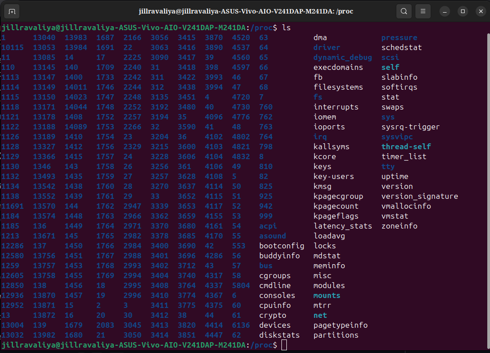

```
jillravaliya@...:/proc$ ls

1       13040  13983  1687   ...  (hundreds of PIDs)
...
acpi          fb           kpagecgroup   pressure
asound        filesystems  kpagecount    schedstat
bootconfig    fs           kpageflags    scsi
buddyinfo     interrupts   latency_stats self
bus           iomem        loadavg       slabinfo
cgroups       ioports      locks         softirqs
cmdline       irq          mdstat        stat
consoles      kallsyms     meminfo       swaps
cpuinfo       kcore        misc          sys
crypto        keys         modules       sysrq-trigger
devices       key-users    mounts        sysvipc
diskstats     kmsg         mtrr          thread-self
dma           kpagecgroup  net           timer_list
driver        ...          pagetypeinfo  tty
dynamic_debug              partitions    uptime
execdomains                              version
                                         version_signature
                                         vmallocinfo
                                         vmstat
                                         zoneinfo
```

### The Numbers Are Running Processes

Every number in `/proc` = a running process ID (PID):

```
1       → systemd (PID 1, the init process)
22      → kthreadd (kernel thread manager)
39      → rcu_gp (RCU grace period kernel thread)
42, 43  → kernel worker threads
...
13040+  → your user processes (high PIDs = started later)

The total count of PIDs = number of running processes on your machine
You can count: ls /proc | grep '^[0-9]' | wc -l
```

### Key /proc Files Decoded

**System info:**
```
/proc/cpuinfo      → CPU details (model, cores, flags, MHz)
  cat /proc/cpuinfo | grep "model name" | head -1
  Output: AMD Athlon Silver 3050U with Radeon Graphics

/proc/meminfo      → RAM usage in detail
  cat /proc/meminfo
  MemTotal:    9853952 kB   (total RAM)
  MemFree:     1234567 kB   (unused)
  MemAvailable:5678901 kB   (available for apps)
  Buffers:      234567 kB   (disk read buffers)
  Cached:      2345678 kB   (page cache)
  SwapTotal:   4194300 kB   (= your 4GB swap.img)
  SwapFree:    4194300 kB   (swap unused = good!)

/proc/uptime       → seconds since boot
  cat /proc/uptime
  "12345.67 89012.34"
  First number = total uptime seconds
  Second = idle CPU seconds (can exceed uptime on multi-core!)

/proc/cmdline      → kernel boot parameters
  cat /proc/cmdline
  "BOOT_IMAGE=/boot/vmlinuz-6.17.0-22-generic root=UUID=d563d94d-... ro quiet splash amdgpu.dc=1"
  This is EXACTLY what GRUB passed to the kernel

/proc/version      → kernel version string
  cat /proc/version
  "Linux version 6.17.0-22-generic (buildd@...) (gcc 13.2.0) #22-Ubuntu SMP"

/proc/loadavg      → system load
  cat /proc/loadavg
  "0.52 0.48 0.45 2/347 4521"
  Numbers: 1min, 5min, 15min load averages
  2/347 = 2 running, 347 total threads
  4521 = last PID assigned
```

**What tools actually read from /proc:**
```
top, htop    → reads /proc/[pid]/stat for CPU usage per process
free         → reads /proc/meminfo
ps           → reads /proc/[pid]/status, /proc/[pid]/cmdline
uptime       → reads /proc/uptime, /proc/loadavg
lsmod        → reads /proc/modules
df           → reads /proc/mounts
lscpu        → reads /proc/cpuinfo
dmesg        → reads /dev/kmsg (not /proc, but related)
netstat      → reads /proc/net/tcp, /proc/net/udp
```

**Process-specific directories:**
```
/proc/[PID]/
  cmdline    ← full command + arguments that started this process
  cwd        ← symlink to current working directory
  exe        ← symlink to the executable file
  fd/        ← directory of all open file descriptors
               fd/0 → stdin, fd/1 → stdout, fd/2 → stderr
               fd/3 → first opened file/socket...
  maps       ← memory map (where .so libraries are mapped in memory)
  net/       ← network connections for this process (namespace)
  status     ← human-readable process status (state, memory, threads)
  stat       ← machine-readable status (used by ps, top)
  io         ← I/O statistics (bytes read/written)
  oom_score  ← OOM killer score (higher = killed first when RAM runs out)
  environ    ← environment variables of the process
               (root-only for other users' processes)
```

**Kernel tunable via /proc/sys:**
```
/proc/sys/ = live kernel parameters

Key ones:
  /proc/sys/net/ipv4/ip_forward
    0 = don't forward packets between interfaces (desktop default)
    1 = forward packets (router/gateway mode)
    Enable: echo 1 | sudo tee /proc/sys/net/ipv4/ip_forward

  /proc/sys/kernel/hostname
    cat → shows hostname
    echo "newname" | sudo tee /proc/sys/kernel/hostname → changes it live!

  /proc/sys/vm/swappiness
    Controls how aggressively kernel uses swap (0-100)
    60 = default (use swap moderately)
    10 = prefer RAM, avoid swap (desktop performance)
    0  = avoid swap entirely (databases)

  /proc/sys/fs/file-max
    Maximum number of open file handles system-wide
    Default ~800000, can increase for high-load servers

Changes to /proc/sys are TEMPORARY (lost on reboot).
Make permanent via /etc/sysctl.conf or /etc/sysctl.d/*.conf
Then: sudo sysctl -p → applies without reboot
```

**Special /proc files:**
```
kallsyms    ← ALL kernel symbols with their memory addresses
             Same data as /boot/System.map but for RUNNING kernel
             Root-only readable (security)
             
kcore       ← the entire kernel memory as an ELF core dump
             Size = your total RAM (virtual, not real file)
             Used by: gdb to inspect live kernel memory
             
crypto      ← kernel's supported cryptographic algorithms:
             aes, sha256, sha512, hmac, cbc, gcm...
             
interrupts  ← interrupt counts per CPU per IRQ:
             Shows: how many times each device interrupted each CPU
             Useful: find if one CPU is handling all interrupts (imbalanced)
             
iomem       ← physical memory map:
             Shows: which physical addresses = RAM vs ROM vs device registers
             
kallsyms    ← kernel symbol table (all function addresses)
buddyinfo   ← buddy allocator state (shows memory fragmentation)
slabinfo    ← slab allocator stats (kernel object caches)
```

---

## Section 9 — /sys (Live Output)

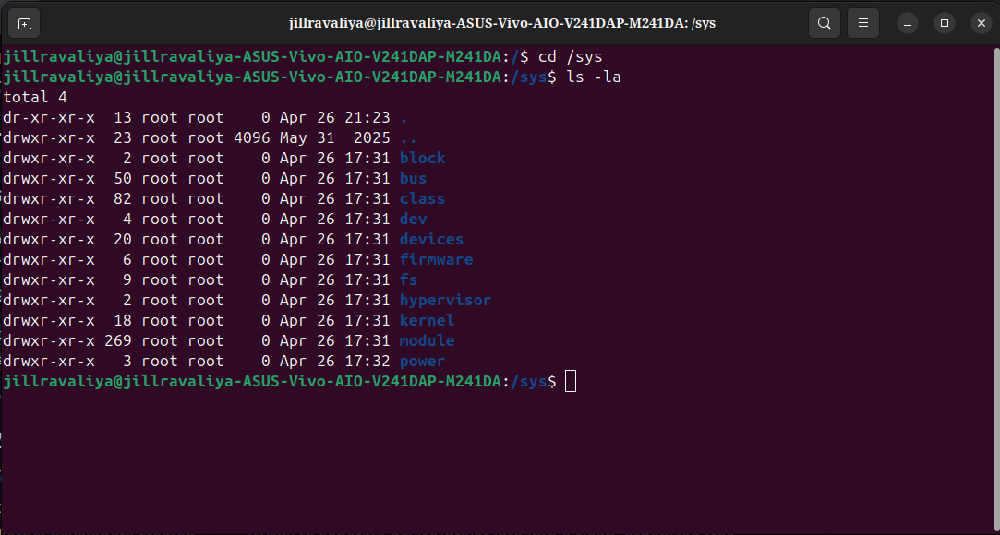

```
jillravaliya@...:/$ cd /sys
jillravaliya@...:/sys$ ls -la

total 4
dr-xr-xr-x  13  root root     0  Apr 26 21:23  .
drwxr-xr-x  23  root root  4096  May 31  2025  ..
drwxr-xr-x   2  root root     0  Apr 26 17:31  block
drwxr-xr-x  50  root root     0  Apr 26 17:31  bus
drwxr-xr-x  82  root root     0  Apr 26 17:31  class
drwxr-xr-x   4  root root     0  Apr 26 17:31  dev
drwxr-xr-x  20  root root     0  Apr 26 17:31  devices
drwxr-xr-x   6  root root     0  Apr 26 17:31  firmware
drwxr-xr-x   9  root root     0  Apr 26 17:31  fs
drwxr-xr-x   2  root root     0  Apr 26 17:31  hypervisor
drwxr-xr-x  18  root root     0  Apr 26 17:31  kernel
drwxr-xr-x 269  root root     0  Apr 26 17:31  module
drwxr-xr-x   3  root root     0  Apr 26 17:32  power
```

### Everything in /sys Has Size 0

Every directory shows **0 bytes**. This is the signature of a virtual filesystem — nothing exists on disk. The kernel generates all content dynamically.

**The parent `..` shows 4096 bytes** (the real /boot directory) but `/sys` itself and all its children = 0.

### The 13 Top-Level Directories

```
block/ (2 entries)
  All block devices: sda, sdb, nvme0n1
  /sys/block/nvme0n1/size → disk size in 512-byte sectors
  /sys/block/nvme0n1/stat → I/O statistics
  /sys/block/nvme0n1/queue/ → I/O scheduler settings
    /sys/block/nvme0n1/queue/scheduler → current I/O scheduler
    echo "deadline" > .../scheduler → change scheduler without reboot!

bus/ (50 entries — 50 hardware buses!)
  Every hardware bus type the kernel knows about:
  /sys/bus/pci/     ← PCIe (GPU, NVMe, Network)
  /sys/bus/usb/     ← USB (keyboard, mouse, webcam)
  /sys/bus/i2c/     ← I2C (sensors, touchpad)
  /sys/bus/spi/     ← SPI (UEFI ROM chip, WiFi on some SoCs)
  /sys/bus/platform/ ← platform devices (ACPI-described hardware)
  /sys/bus/hid/     ← HID devices (keyboards, mice)
  /sys/bus/input/   ← input devices

  lspci reads: /sys/bus/pci/devices/
  lsusb reads: /sys/bus/usb/devices/

class/ (82 entries — 82 device classes!)
  Groups devices by function, regardless of bus:
  /sys/class/net/       ← network interfaces (eth0, wlan0, lo)
  /sys/class/block/     ← block devices
  /sys/class/input/     ← input devices
  /sys/class/drm/       ← GPU display devices
  /sys/class/backlight/ ← screen brightness control
  /sys/class/thermal/   ← temperature sensors
  /sys/class/power_supply/ ← battery and AC adapter
  /sys/class/sound/     ← audio devices
  /sys/class/tty/       ← terminal devices
  /sys/class/rtc/       ← real-time clock
  /sys/class/leds/      ← LED indicators (keyboard backlight, etc.)
  /sys/class/rfkill/    ← WiFi/Bluetooth kill switches

  82 classes = 82 types of hardware this kernel understands

devices/ (20 entries)
  The physical device tree:
  /sys/devices/system/cpu/   ← CPU info + frequency scaling
  /sys/devices/system/memory/ ← RAM topology
  /sys/devices/pci0000:00/   ← PCIe root complex + all PCIe devices
  /sys/devices/platform/     ← ACPI platform devices

firmware/ (6 entries)
  UEFI/ACPI firmware information:
  /sys/firmware/efi/         ← UEFI variables, Secure Boot state
  /sys/firmware/efi/efivars/ ← read/write UEFI NVRAM from Linux!
  /sys/firmware/acpi/        ← ACPI tables
  /sys/firmware/dmi/         ← DMI/SMBIOS hardware info

  Read UEFI boot order: cat /sys/firmware/efi/efivars/BootOrder-*
  This is how efibootmgr reads/writes boot entries without rebooting

fs/ (9 entries)
  Filesystem information:
  /sys/fs/cgroup/   ← cgroup v2 hierarchy
  /sys/fs/ext4/     ← ext4 filesystem tuning
  /sys/fs/btrfs/    ← btrfs info (if mounted)

hypervisor/ (2 entries)
  Hypervisor interface (if running inside a VM):
  Your machine shows this but is likely bare metal
  KVM/Xen/VMware expose themselves here

kernel/ (18 entries)
  Kernel runtime settings:
  /sys/kernel/debug/    ← debugfs (kernel internals for developers)
  /sys/kernel/mm/       ← memory management settings
  /sys/kernel/mm/transparent_hugepage/ → huge page settings
  /sys/kernel/security/ ← LSM (AppArmor, SELinux) interface

module/ (269 entries — 269 loaded kernel modules!)
  Every currently loaded .ko module:
  /sys/module/amdgpu/   ← AMD GPU driver parameters
  /sys/module/nvme/     ← NVMe driver
  /sys/module/bluetooth/
  /sys/module/usbcore/
  ...

  269 modules = everything your kernel has loaded
  Compare: lsmod | wc -l → same count

power/ (3 entries)
  System power management:
  /sys/power/state → what power states are available:
    cat /sys/power/state → "freeze mem disk"
    echo mem > /sys/power/state → suspend to RAM
    echo disk > /sys/power/state → hibernate to disk
```

### /sys as a Control Panel — Real Examples

```bash
# Read current CPU frequency (kHz)
cat /sys/devices/system/cpu/cpu0/cpufreq/scaling_cur_freq
# 2300000 = 2.3 GHz

# Change CPU governor
echo "performance" | sudo tee /sys/devices/system/cpu/cpu*/cpufreq/scaling_governor
# Now all CPUs run at max frequency

# Check battery level (if laptop)
cat /sys/class/power_supply/BAT0/capacity
# 87 (= 87%)

# Check if AC is connected
cat /sys/class/power_supply/AC/online
# 1 = yes, 0 = no

# Read screen brightness
cat /sys/class/backlight/*/brightness

# Set brightness (0-100 or 0-max_brightness)
echo 50 | sudo tee /sys/class/backlight/*/brightness

# Check network card state
cat /sys/class/net/wlan0/operstate
# "up" or "down"

# Read temperature sensors
cat /sys/class/thermal/thermal_zone*/temp
# Values in millidegrees: 45000 = 45°C

# Check if WiFi is killswitched
cat /sys/class/rfkill/rfkill0/soft
# 0 = enabled, 1 = disabled

# List all PCIe devices (what lspci reads)
ls /sys/bus/pci/devices/
```

---

## /proc vs /sys vs /dev — The Three Virtual Worlds

```
                 /proc              /sys               /dev
─────────────────────────────────────────────────────────────────
Purpose:    process + kernel     device + driver    hardware
            live information     settings/control   interfaces

Contents:   PIDs (running procs) device attributes  device nodes
            kernel parameters   hardware controls   (files for I/O)
            memory/CPU stats    driver parameters

Analogy:    car dashboard        settings menu +     steering wheel
            (what's happening)  control knobs        + pedals
                                (adjust behavior)    (direct use)

Size:       0 bytes (virtual)   0 bytes (virtual)   varies
                                                     (special files)

Write?:     /proc/sys writable  most files writable  read/write
            (kernel tunables)   (control hardware)   (data I/O)

Example:    /proc/meminfo       /sys/class/backlight /dev/sda
            (how much RAM?)     /brightness          (write disk)
                                (set brightness)

Created:    at boot (procfs)    at boot (sysfs)      devtmpfs + udev
```

---

## Section 10 — /usr (Live Output)

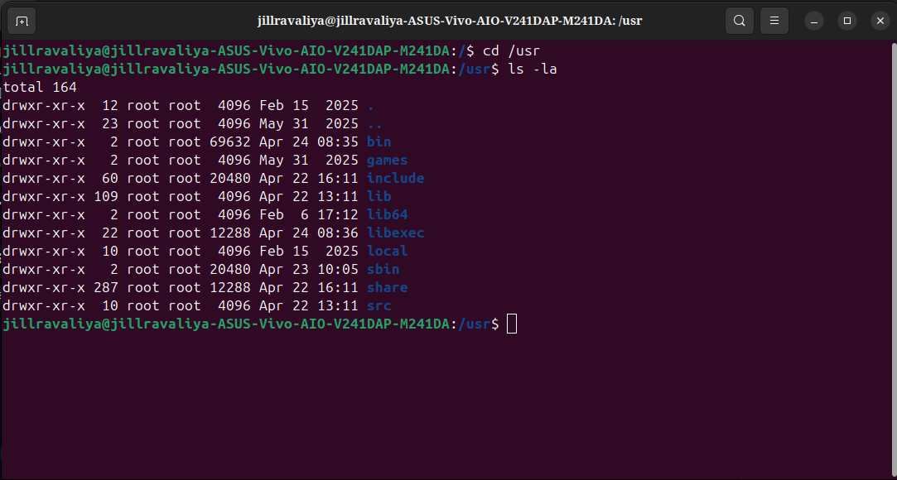

```
jillravaliya@...:/$ cd /usr
jillravaliya@...:/usr$ ls -la

total 164
drwxr-xr-x  12  root root   4096  Feb 15  2025  .
drwxr-xr-x  23  root root   4096  May 31  2025  ..
drwxr-xr-x   2  root root  69632  Apr 24 08:35  bin
drwxr-xr-x   2  root root   4096  May 31  2025  games
drwxr-xr-x  60  root root  20480  Apr 22 16:11  include
drwxr-xr-x 109  root root   4096  Apr 22 13:11  lib
drwxr-xr-x   2  root root   4096  Feb  6 17:12  lib64
drwxr-xr-x  22  root root  12288  Apr 24 08:36  libexec
drwxr-xr-x  10  root root   4096  Feb 15  2025  local
drwxr-xr-x   2  root root  20480  Apr 23 10:05  sbin
drwxr-xr-x 287  root root  12288  Apr 22 16:11  share
drwxr-xr-x  10  root root   4096  Apr 22 13:11  src
```

### Reading /usr's Sizes

```
bin/      69632 bytes directory entry  ← same as /bin (it IS /bin)
                                          69KB of filenames = enormous
include/  20480 bytes, 60 subdirs      ← 60 software packages' header files
lib/       4096 bytes, 109 subdirs     ← 109 library packages
libexec/  12288 bytes, 22 subdirs      ← internal helper executables
sbin/     20480 bytes, 2 subdirs       ← system admin tools
share/    12288 bytes, 287 subdirs     ← 287 software data packages!
src/       4096 bytes, 10 subdirs      ← kernel/package source files
```

**287 subdirectories in /usr/share** = 287 packages with architecture-independent data installed. This is your entire software ecosystem's data.

### Every /usr Subdirectory

```
bin/      ← ALL user binaries (= /bin, the symlink target)
           Every command you ever run: firefox, python3, gcc, git, vim...

games/    ← game binaries (if any games installed)
           Even servers have this directory (empty usually)

include/  ← C/C++ header files for development
           /usr/include/linux/    ← Linux kernel headers
           /usr/include/stdio.h   ← C standard library
           /usr/include/python3.12/ ← Python headers
           60 packages' worth of headers = active development machine

lib/      ← shared libraries and package data (109 packages!)
           /usr/lib/python3/       ← Python standard library
           /usr/lib/x86_64-linux-gnu/ ← 64-bit shared libraries
           /usr/lib/systemd/       ← systemd unit files (default set)
           /usr/lib/modules/       ← kernel modules (/lib/modules symlinked here)

lib64/    ← 64-bit specific libraries
           /usr/lib64/ld-linux-x86-64.so.2 ← dynamic linker for 64-bit

libexec/  ← internal helper programs (not for users to run directly)
           22 packages use this = advanced software installed
           Examples:
             /usr/libexec/gnome-session-binary
             /usr/libexec/packagekitd
             /usr/libexec/colord
           These are daemons/helpers that apps launch internally
           They're in PATH, just not in a user's $PATH

local/    ← locally installed software (NOT managed by apt/dpkg)
           The "admin's personal space":
           /usr/local/bin/    ← binaries you compiled yourself
           /usr/local/lib/    ← libraries you built
           /usr/local/share/  ← data for local software
           /usr/local/etc/    ← configs for local software
           apt never touches /usr/local/ → safe from package updates

sbin/     ← system admin binaries (= /sbin, the symlink target)
           20480 bytes = large, but fewer files than /bin

share/    ← architecture-independent data (287 packages!)
           /usr/share/applications/ ← .desktop files (GUI app launchers)
           /usr/share/doc/          ← package documentation
           /usr/share/man/          ← manual pages (what `man ls` reads)
           /usr/share/fonts/        ← system fonts (TTF, OTF)
           /usr/share/icons/        ← theme icons (what you see in GUI)
           /usr/share/locale/       ← translations (i18n files)
           /usr/share/pixmaps/      ← legacy app icons
           /usr/share/themes/       ← GUI themes
           /usr/share/bash-completion/ ← tab completion scripts
           /usr/share/nodejs/       ← Node.js packages
           /usr/share/python3/      ← Python packages
           /usr/share/X11/          ← X11 configuration
           /usr/share/sounds/       ← system sound effects

src/      ← source code (10 packages with sources installed)
           /usr/src/linux-headers-6.17.0-22-generic/ ← kernel headers!
           Used for: compiling DKMS modules against current kernel
           /usr/src/linux-headers-6.17.0-20-generic/ ← old kernel headers too
```

---

## Section 11 — /home (Live Output)

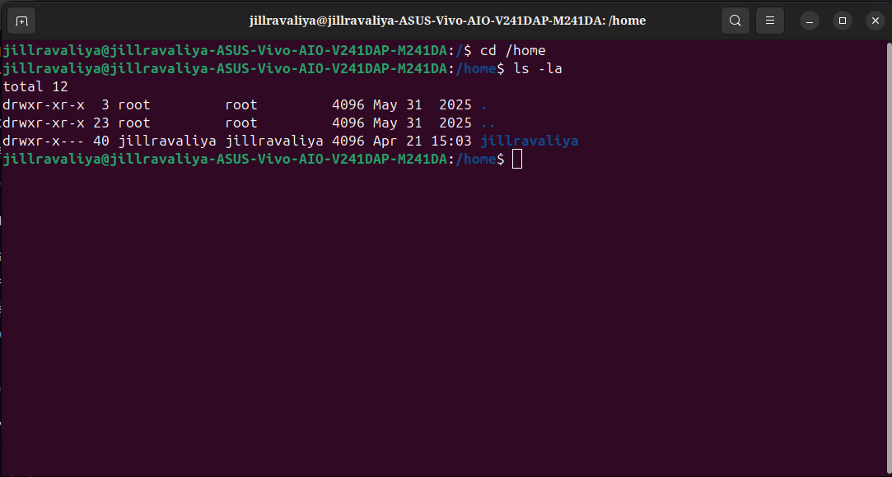

```
jillravaliya@...:/$ cd /home
jillravaliya@...:/home$ ls -la

total 12
drwxr-xr-x   3  root       root       4096  May 31  2025  .
drwxr-xr-x  23  root       root       4096  May 31  2025  ..
drwxr-x---  40  jillravaliya jillravaliya 4096 Apr 21 15:03 jillravaliya
```

### Reading This Output Carefully

```
total 12
Only 3 entries: ., .., jillravaliya
= this machine has exactly ONE non-root user: jillravaliya

drwxr-x---  40  jillravaliya  jillravaliya  4096  Apr 21 15:03  jillravaliya
│            │   │              │             │     │
│            │   │              │             │     └── Apr 21 = last activity
│            │   │              │             └── 4096 bytes = dir metadata
│            │   │              └── group: jillravaliya (private group)
│            │   └── owner: jillravaliya
│            └── 40 hard links = 40 subdirectories inside home!
└── drwxr-x--- = 750 permissions (see below)
```

**Permission `drwxr-x---` = 750:**
```
Owner (jillravaliya): rwx = read + write + enter
Group (jillravaliya): r-x = read + enter (but not write!)
Others: --- = NOTHING — no read, no enter, no write

This means:
  jillravaliya can do everything in their home
  Members of jillravaliya's group can read but not write
  EVERYONE ELSE: cannot even LIST the contents!

Try as another user: ls /home/jillravaliya → "Permission denied"
Even root CAN (root bypasses permissions), but normal users cannot.
```

**40 hard links = 40 subdirectories:**
```
/home/jillravaliya has 40 subdirectories inside it.
Each subdirectory contributes 1 hard link (its .. points back to parent).

40 subdirectories is a LOT — suggests either:
  Many active projects
  Many application config folders in ~/
  .config/ with many app subdirs
  Development workspace with many project folders

Typical home structure:
  Desktop/  Documents/  Downloads/  Music/  Pictures/  Videos/
  .config/  .local/  .cache/  .ssh/  .bashrc  .bash_history
  + project directories + tool configs
```

**Apr 21 15:03 — 5 days ago:**
```
The /home/jillravaliya directory metadata was last modified Apr 21.
This doesn't mean files inside weren't touched — files inside have their own timestamps.
The directory modification time = when a file was added or removed from this dir.
Apr 21 = the last time a new subdirectory was created or removed.
```

---

## Section 12 — /var (Live Output)

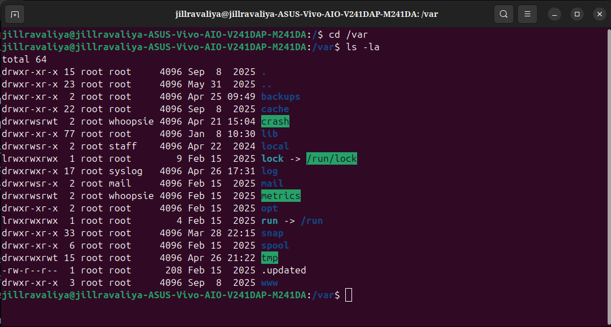

```
jillravaliya@...:/$ cd /var
jillravaliya@...:/var$ ls -la

total 64
drwxr-xr-x  15  root    root     4096  Sep  8  2025  .
drwxr-xr-x  23  root    root     4096  May 31  2025  ..
drwxr-xr-x   2  root    root     4096  Apr 25 09:49  backups
drwxr-xr-x  22  root    root     4096  Sep  8  2025  cache
drwxrwsrwt   2  root    whoopsie 4096  Apr 21 15:04  crash
drwxr-xr-x  77  root    root     4096  Jan  8 10:30  lib
drwxrwsr-x   2  root    staff    4096  Apr 22  2024  local
lrwxrwxrwx   1  root    root        9  Feb 15  2025  lock -> /run/lock
drwxr-xr-x  17  root    syslog   4096  Apr 26 17:31  log
drwxrwsr-x   2  root    mail     4096  Feb 15  2025  mail
drwxrwsrwt   2  root    whoopsie 4096  Feb 15  2025  metrics
drwxr-xr-x   2  root    root     4096  Feb 15  2025  opt
lrwxrwxrwx   1  root    root        4  Feb 15  2025  run -> /run
drwxr-xr-x  33  root    root     4096  Mar 28 22:15  snap
drwxr-xr-x   6  root    root     4096  Feb 15  2025  spool
drwxrwxrwt  15  root    root     4096  Apr 26 21:22  tmp
-rw-r--r--   1  root    root      208  Feb 15  2025  .updated
drwxr-xr-x   3  root    root     4096  Sep  8  2025  www
```

### Reading /var — Every Entry Explained

**Permissions reveal who owns what:**

```
drwxr-xr-x  log    (owner: root, group: syslog)
  Group syslog can write here — the syslog daemon runs as user "syslog"
  Security: syslog daemon doesn't need root just to write logs

drwxrwsrwt  crash  (owner: root, group: whoopsie)
  The "s" in group permissions = setgid bit
  Any file created inside /var/crash inherits group "whoopsie"
  "t" = sticky bit (can only delete your own files)
  whoopsie = Ubuntu crash reporter daemon
  When your app crashes → crash dump → /var/crash → whoopsie reports it

drwxrwsr-x  mail   (owner: root, group: mail)
  setgid: files inherit "mail" group
  Only mail group members can write

drwxrwsrwt  metrics (owner: root, group: whoopsie)
  Same pattern as crash — whoopsie collects metrics

drwxrwsr-x  local  (owner: root, group: staff)
  staff group can write here
  For admin-installed local variable data
```

**The symlinks reveal the modern design:**
```
lock → /run/lock    ← /var/lock is now really /run/lock (tmpfs!)
run  → /run         ← /var/run is now really /run (tmpfs!)

Historical: /var/lock and /var/run were on disk
Modern: they're in RAM (/run is tmpfs) for performance
The symlinks exist for backward compatibility:
  Old programs use /var/lock → they transparently hit /run/lock
  No code changes needed
```

**The entries decoded:**
```
backups/      ← system backup files
               /var/backups/dpkg.status → backup of installed package list
               /var/backups/passwd.bak  → backup of /etc/passwd
               Created by cron.daily scripts automatically

cache/        ← application caches (22 packages worth!)
               /var/cache/apt/          ← downloaded .deb packages
               /var/cache/apt/archives/ ← the actual .deb files
               /var/cache/apt/lists/    ← package list metadata
               /var/cache/man/          ← pre-formatted man pages
               /var/cache/fontconfig/   ← font cache
               /var/cache/pip/          ← Python package cache

crash/        ← application crash dumps
               When a program crashes with a signal → core dump here
               whoopsie daemon picks them up → sends to Ubuntu error tracker
               Ubuntu developers analyze crashes from many users' machines

lib/          ← persistent application data (77 packages!)
               /var/lib/apt/            ← dpkg/apt state
               /var/lib/dpkg/           ← list of installed packages
               /var/lib/mysql/          ← MySQL database files (if installed)
               /var/lib/docker/         ← Docker images/containers/volumes
               /var/lib/snapd/          ← snap package state
               /var/lib/systemd/        ← systemd persistent state
               /var/lib/NetworkManager/ ← saved WiFi passwords, connection info!
               /var/lib/bluetooth/      ← paired Bluetooth device info
               /var/lib/gdm3/           ← GDM display manager state
               77 entries = 77 packages store state here

log/          ← all system logs (owner: root, group: syslog, Apr 26 17:31)
               Updated TODAY at 17:31 = actively being written
               /var/log/syslog          ← general system log
               /var/log/auth.log        ← authentication (login attempts!)
               /var/log/kern.log        ← kernel messages
               /var/log/dpkg.log        ← package install/remove history
               /var/log/apt/            ← apt operation history
               /var/log/journal/        ← systemd binary journal
               /var/log/gdm3/           ← display manager logs
               /var/log/cups/           ← printing logs
               /var/log/apache2/        ← web server logs (you have Apache!)
               /var/log/nvidia-installer.log ← NVIDIA driver install log

mail/         ← local email storage
               Old-school Unix mail (not webmail)
               Each user gets a mailbox file: /var/mail/jillravaliya
               System services send mail to root → /var/mail/root
               cron sends job output to user's mail here

metrics/      ← whoopsie metrics collection
               Ubuntu's error/telemetry reporting

opt/          ← variable data for /opt software
               Companion to /opt (binaries) for runtime data

snap/         ← snap package variable data (33 packages!)
               /var/snap/firefox/      ← Firefox snap's data
               /var/snap/snap-store/   ← Snap store data
               Each snap has its own isolated /var/snap directory

spool/        ← queued data waiting to be processed
               /var/spool/cron/        ← cron job definitions
               /var/spool/cups/        ← print queue
               /var/spool/mail/        ← alternative mail location
               /var/spool/apt/         ← apt pre-download cache

tmp/          ← persistent temporary files (drwxrwxrwt)
               Sticky bit: everyone can write, only owner can delete
               Unlike /tmp: SURVIVES reboots (stays between boots)
               For: temporary data that needs to outlast a session
               Cleared by: cron job or admin, not automatically

www/          ← web server data (3 entries)
               /var/www/html/ ← Apache default web root
               You have Apache! Your web server's HTML files go here
               Default: /var/www/html/index.html → "Apache2 Default Page"
```

**Sep 8 2025 date on `.` and `cache/`:**
```
The /var directory itself was last modified Sep 8 2025.
This is AFTER today (Apr 26 2026) — wait, no.
Sep 8 2025 < Apr 26 2026 — it's in the past (8 months ago).

This means: the last time a new directory was added to /var was Sep 8.
Since then: no new packages created directories in /var.
But existing directories (like log/) are modified much more recently (Apr 26).
```

---

## Section 13 — /opt (Live Output)

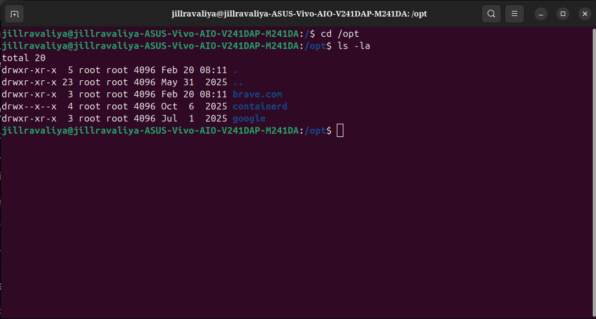

```
jillravaliya@...:/$ cd /opt
jillravaliya@...:/opt$ ls -la

total 20
drwxr-xr-x   5  root root  4096  Feb 20 08:11  .
drwxr-xr-x  23  root root  4096  May 31  2025  ..
drwxr-xr-x   3  root root  4096  Feb 20 08:11  brave.com
drwx--x--x   4  root root  4096  Oct  6  2025  containerd
drwxr-xr-x   3  root root  4096  Jul  1  2025  google
```

### Three Third-Party Apps — Each With a Story

```
brave.com/      (Feb 20 08:11)
  The Brave browser is installed on this machine.
  /opt/brave.com/ → Brave's entire application bundle
  Brave doesn't use apt as primary install method
  It installs directly to /opt to avoid conflicts
  Why brave.com not just "brave"? To avoid name collisions:
    If two companies made "brave" software, they'd conflict
    Using the domain name = globally unique namespace

containerd/     (Oct 6 2025)   drwx--x--x permissions!
  containerd = container runtime (Docker uses this under the hood)
  Installed Oct 6 2025 (recently)
  Unusual permissions: drwx--x--x (711)
    Owner (root): can read, write, enter
    Group: can only enter (not list!)
    Others: can only enter (not list!)
  Why 711? Security: you can USE things inside if you know the path,
  but you can't LIST what's in there without being root.
  This prevents unauthorized enumeration of container internals.

google/         (Jul 1 2025)
  Google's software — likely Google Chrome or related tools
  /opt/google/ usually contains: google-chrome, googler, etc.
  Jul 1 2025 = installed 9 months ago
```

**The dates reveal the machine's history:**
```
May 31  2025 → OS installed (Ubuntu installed)
Jul  1  2025 → Google software installed (1 month after install)
Oct  6  2025 → containerd installed (4 months after install)
Feb 20 08:11 → Brave browser installed (8 months after install)
```

---

## Section 14 — /mnt (Live Output)

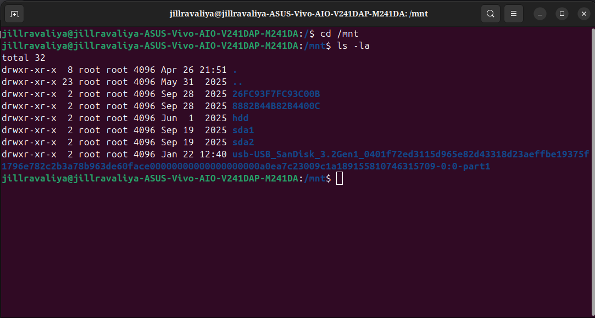

```
jillravaliya@...:/$ cd /mnt
jillravaliya@...:/mnt$ ls -la

total 32
drwxr-xr-x   8  root root  4096  Apr 26 21:51  .
drwxr-xr-x  23  root root  4096  May 31  2025  ..
drwxr-xr-x   2  root root  4096  Sep 28  2025  26FC93F7FC93C00B
drwxr-xr-x   2  root root  4096  Sep 28  2025  8882B44BB2B4400C
drwxr-xr-x   2  root root  4096  Jun  1  2025  hdd
drwxr-xr-x   2  root root  4096  Sep 19  2025  sda1
drwxr-xr-x   2  root root  4096  Sep 19  2025  sda2
drwxr-xr-x   2  root root  4096  Jan 22 12:40  usb-USB_SanDisk_3.2Gen1_0401f72ed3115d965e82d43318d23aeffbe19375f1796e782c2b3a78b963de60face00000000000000000000a0ea7c23009c1a189155810746315709-0:0-part1
```

### /mnt is NOT Empty — This Machine Mounts Things Here Manually

```
26FC93F7FC93C00B/   (Sep 28 2025)
8882B44BB2B4400C/   (Sep 28 2025)
  These are Windows-style hex IDs — NTFS partition volume serial numbers!
  This machine has/had Windows partitions or external NTFS drives.
  These directories were created as mount points for NTFS volumes.
  The IDs are the NTFS Volume Serial Numbers.

hdd/                (Jun 1 2025)
  A hard disk drive was mounted here.
  Created Jun 1 2025 = 1 day after OS install!
  Someone immediately attached an HDD.

sda1/ and sda2/     (Sep 19 2025)
  Mount points for sda1 and sda2 partitions.
  Manually created and used.

usb-USB_SanDisk_3.2Gen1_0401f72ed3...
  The FULL udev-generated persistent device name of a SanDisk 3.2 Gen1 USB drive!
  That incredibly long name = udev's by-id name:
    "usb-" = USB device
    "USB_SanDisk_3.2Gen1" = product name
    "0401f72ed3115d965e82d43318d23aeffbe19375..." = serial number (unique!)
    "-0:0-part1" = SCSI host 0, target 0, partition 1

  Created Jan 22 12:40 = recently (3 months ago)
  This USB drive was manually mounted here.
```

**Why use /mnt instead of /media?**
```
/media = automatic mounting (udev/udisks2 does it, GUI shows it)
/mnt   = manual mounting (admin does it, usually for specific reasons)

These mnt entries suggest intentional work:
  - Accessing NTFS Windows partitions (the hex ID folders)
  - Mounting an external HDD for backup/transfer
  - Mounting specific partitions (sda1, sda2) for repair/recovery
  - Mounting a SanDisk USB manually for direct control
```

---

## Section 15 — /media (Live Output)

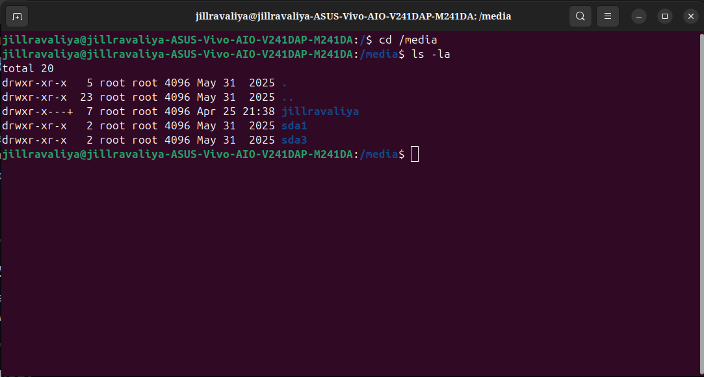

```
jillravaliya@...:/$ cd /media
jillravaliya@...:/media$ ls -la

total 20
drwxr-xr-x    5  root        root  4096  May 31  2025  .
drwxr-xr-x   23  root        root  4096  May 31  2025  ..
drwxr-x---+   7  root        root  4096  Apr 25 21:38  jillravaliya
drwxr-xr-x    2  root        root  4096  May 31  2025  sda1
drwxr-xr-x    2  root        root  4096  May 31  2025  sda3
```

### The `+` in Permissions — ACL in Action

```
drwxr-x---+  7  root  root  4096  Apr 25 21:38  jillravaliya
           ^
           This + means: ACL (Access Control List) is set on this directory

Normal Unix permissions: rwxr-x--- (just owner/group/others)
ACL: extends this with per-user and per-group rules

Why ACL here?
  /media/jillravaliya needs to be:
    Writable by jillravaliya (auto-mount their USB drives)
    Accessible by the session group (polkit/udisks2 requires this)
    But not accessible by others
  
  Standard Unix permissions can't express this combination cleanly.
  ACL adds: user:jillravaliya:rwx specifically for this directory.

Check ACLs with:
  getfacl /media/jillravaliya
```

**7 subdirectories inside /media/jillravaliya:**
```
/media/jillravaliya/ has 7 entries (from hard link count).
These are your auto-mounted devices.
Updated Apr 25 21:38 = yesterday (you mounted something yesterday).

Your automatically mounted devices likely include:
  /media/jillravaliya/USB_LABEL/    (USB drives)
  /media/jillravaliya/DISK_NAME/    (external drives)
  etc.
```

**sda1 and sda3 at the /media level:**
```
drwxr-xr-x  2  root  root  4096  May 31  2025  sda1
drwxr-xr-x  2  root  root  4096  May 31  2025  sda3

These are SYSTEM-LEVEL mount points (not user-specific).
Created at install time (May 31 2025 = install day).
May be: the installer auto-detected sda1 and sda3 as existing partitions
and created mount points for them in /media.

Note: sda2 is in /mnt not /media — manually mounted (see /mnt section).
```

---

## Section 16 — /srv (Live Output)

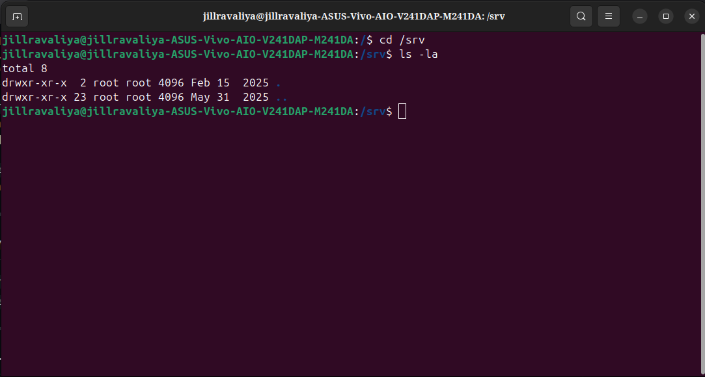

```
jillravaliya@...:/$ cd /srv
jillravaliya@...:/srv$ ls -la

total 8
drwxr-xr-x   2  root root  4096  Feb 15  2025  .
drwxr-xr-x  23  root root  4096  May 31  2025  ..
```

### /srv is Empty — and That's a Story

**Only 2 entries (. and ..)** = completely empty. Created Feb 15 2025.

```
/srv SHOULD contain:
  /srv/www/         ← web server content
  /srv/ftp/         ← FTP shared files
  /srv/git/         ← git repositories
  /srv/nfs/         ← NFS network share content

BUT this machine uses /var/www/ for Apache (as seen in /var section).

Two conventions exist and both are valid:
  Convention 1: /var/www/html/   ← Debian/Ubuntu Apache default
  Convention 2: /srv/www/html/   ← FHS recommendation

Ubuntu uses /var/www by default.
/srv exists and is empty = system follows FHS but Apache uses /var/www.
This is the most common real-world setup on Ubuntu.

When would you USE /srv?
  sudo mkdir /srv/mywebsite
  sudo cp -r website/* /srv/mywebsite/
  Update Apache config to: DocumentRoot /srv/mywebsite
  Advantage: cleaner separation from /var's variable data
```

---

## Section 17 — /run (Live Output)

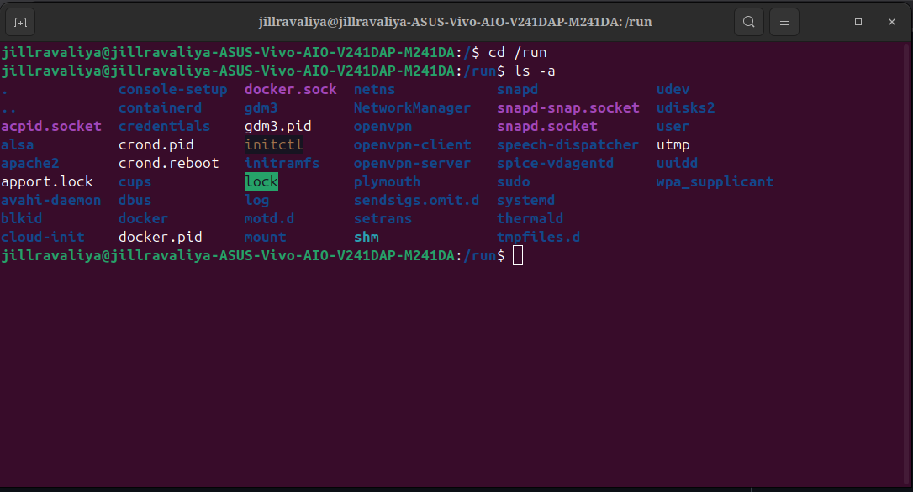

```
jillravaliya@...:/$ cd /run
jillravaliya@...:/run$ ls -a

.               console-setup  docker.sock      netns          udev
..              containerd     gdm3             NetworkManager udisks2
acpid.socket    credentials    gdm3.pid         openvpn        user
alsa            crond.pid      initctl          openvpn-client utmp
apache2         crond.reboot   initramfs        openvpn-server uuidd
apport.lock     cups           lock             plymouth       wpa_supplicant
avahi-daemon    dbus           log              sendsigs.omit.d
blkid           docker         motd.d           setrans
cloud-init      docker.pid     mount            shm
                                                snapd
                                                snapd-snap.socket
                                                snapd.socket
                                                speech-dispatcher
                                                spice-vdagentd
                                                sudo
                                                systemd
                                                thermald
                                                tmpfiles.d
                                                udev
                                                udisks2
                                                user
                                                utmp
                                                uuidd
                                                wpa_supplicant
```

### /run — The Complete Runtime World

**Everything in /run disappears at shutdown and is recreated at boot.**

```
Service PID files:
  gdm3.pid         ← GDM display manager PID
  crond.pid        ← cron daemon PID
  crond.reboot     ← marker: cron should run @reboot jobs
  docker.pid       ← Docker daemon PID
  
  PID files tell systemd (and other tools): "I'm process 1234"
  Before PID files: killing a daemon meant guessing the PID

Socket files (.socket = Unix domain sockets):
  docker.sock      ← Docker API socket (the Docker CLI uses this)
                     ls -la /run/docker.sock → srw-rw---- (s = socket)
                     "docker ps" → connects to /run/docker.sock
  acpid.socket     ← ACPI event socket (power button, lid close)
  snapd.socket     ← Snap daemon API
  snapd-snap.socket ← Snap package communication
  dbus             ← D-Bus system bus (the whole desktop IPC)
  
  Sockets are like IP ports but for local communication:
    No network overhead
    Much faster (direct kernel memory copy)
    No port number needed

Lock files:
  lock/            ← directory of lock files
  apport.lock      ← prevents multiple apport crash reporters
  
  Lock files prevent: two instances of same daemon running simultaneously
  If lock exists and PID is still alive → "already running, exit"
  If lock exists but PID is dead → "stale lock, remove and start"

Running system state:
  utmp             ← who is currently logged in (used by `who`, `w`, `last`)
  motd.d/          ← "Message of the Day" fragments (shown at login)
  mount/           ← mount namespace information
  initramfs/       ← initramfs state (early boot info kept for reference)
  credentials/     ← systemd credential files (encrypted secrets for services)

Services you can see running:
  alsa/            ← ALSA sound state
  apache2/         ← Apache web server runtime (YOUR web server is running!)
  avahi-daemon/    ← mDNS/Bonjour service discovery
  cups/            ← CUPS printing service
  docker/          ← Docker container runtime
  containerd/      ← containerd (Docker's container runtime)
  NetworkManager/  ← network management
  openvpn/         ← OpenVPN (VPN software running!)
  openvpn-client/  ← OpenVPN client config
  openvpn-server/  ← OpenVPN server config
  plymouth/        ← boot splash screen
  snapd/           ← snap package daemon
  speech-dispatcher/ ← text-to-speech accessibility
  spice-vdagentd/  ← SPICE virtual machine agent
  thermald/        ← thermal management daemon
  wpa_supplicant/  ← WiFi WPA authentication
  udev/            ← udev device manager runtime

Systemd runtime:
  systemd/         ← systemd's own runtime state
  user/            ← per-user systemd instances:
                     /run/user/1000/ ← jillravaliya's user session data
                     /run/user/1000/wayland-0 ← Wayland socket!
                     /run/user/1000/pulse/ ← PulseAudio socket
                     /run/user/1000/bus ← user D-Bus session

shm/             ← shared memory (tmpfs)
                   /dev/shm is the same mount
                   Processes put shared data here: very fast IPC

log/             ← runtime logs (symlinked from /var/log/... for some)

Security:
  sudo/            ← sudo authentication state
  setrans/         ← SELinux translation daemon
```

**docker.sock — why it matters:**
```
/run/docker.sock is the Docker API endpoint.

When you run: docker ps
Docker CLI does: connect to /run/docker.sock → send API request → get response

Security implication:
  Access to /run/docker.sock = root access!
  Any process that can write to docker.sock can:
    Start containers that mount / (root filesystem)
    Effectively become root on the host
  
  This is why: don't add users to the "docker" group carelessly.
  It's equivalent to: sudo without password.
```

---

## The Three Confusions Cleared

### Confusion 1: Does /dev "store" input?

```
WRONG: /dev/input stores keyboard/mouse events temporarily.

CORRECT: /dev/input/eventX is a LIVE STREAM, not storage.

Think of /dev/input/eventX like a river:
  You can stand at the bank and read what flows past RIGHT NOW.
  You can't go back upstream to read what already flowed.
  Nothing is stored.

Try it yourself:
  sudo cat /dev/input/event0
  Now press keys or move mouse → see binary data stream
  Stop → nothing remains

The kernel driver produces events.
/dev/eventX = the pipe those events flow through.
X11/Wayland = the program reading from the pipe.
```

### Confusion 2: Does /etc give permissions?

```
WRONG: /etc gives permissions to things.

CORRECT: /etc is a READ-ONLY rulebook. Other programs enforce the rules.

/etc/fstab doesn't MOUNT anything.
  → systemd reads it at boot → mounts partitions

/etc/passwd doesn't AUTHENTICATE anyone.
  → PAM reads it → decides if login is valid

/etc/sudoers doesn't GRANT sudo.
  → sudo binary reads it → decides if the user is allowed

/etc = the book of rules.
Kernel + services = the ones who read and apply those rules.
```

### Confusion 3: Are /bin and /sbin inside /usr?

```
HISTORICAL ANSWER:
  /bin and /sbin were at root level / (separate from /usr)
  Reason: /usr might be on a different disk, not mounted at boot
  So / needed its own survival tools: /bin, /sbin, /lib

MODERN UBUNTU ANSWER:
  /bin  → symlink to /usr/bin
  /sbin → symlink to /usr/sbin
  /lib  → symlink to /usr/lib
  Reason: / and /usr are always on same partition now

Proof from your machine (Image 1):
  lrwxrwxrwx  bin  -> usr/bin      ← confirmed symlink
  lrwxrwxrwx  sbin -> usr/sbin     ← confirmed symlink
  lrwxrwxrwx  lib  -> usr/lib      ← confirmed symlink
  
  bin.usr-is-merged    ← Ubuntu's marker confirming the merge
  sbin.usr-is-merged   ← same
  lib.usr-is-merged    ← same

CONCEPT that still holds:
  /bin items = user commands (everyone needs them)
  /sbin items = root/admin commands (system management)
  The merge doesn't change their purpose, just their physical location.
```

---

## The Complete Filesystem Map — Boot to Desktop

```
Power ON
  ↓
UEFI reads /boot/efi/ (FAT32)    ← /boot/efi/EFI/ubuntu/shimx64.efi
  ↓
GRUB reads /boot/ (ext4)         ← /boot/grub/grub.cfg, /boot/vmlinuz
  ↓
Kernel starts
  /proc mounted (virtual)        ← kernel exposes process/memory info
  /sys mounted (virtual)         ← kernel exposes hardware info
  /dev populated (devtmpfs)      ← minimal device nodes appear
  ↓
initramfs in RAM                 ← temporary / (not from disk)
  Loads /lib/modules driver      ← nvme.ko from initrd
  Finds /dev/nvme0n1p2
  ↓
Real / mounted (ext4 from SSD)
  /bin, /sbin, /lib available    ← via symlinks → /usr/bin, etc.
  /etc available                 ← systemd starts reading rules
  ↓
systemd (PID 1)
  Reads /etc/fstab               ← mounts /boot/efi, swap, /home
  Starts services                ← reads /usr/lib/systemd/system/
  Populates /run                 ← PID files, sockets, locks
  ↓
Login
  Reads /etc/passwd, /etc/shadow ← PAM authenticates
  Reads ~/.bashrc, ~/.profile    ← from /home/jillravaliya/
  ↓
Desktop running
  /proc → tools like top, ps, free
  /sys  → brightness, CPU freq, battery
  /dev  → mouse, keyboard, GPU, audio
  /var/log → everything logged continuously
  /tmp, /run → temporary runtime data
  /home → your files and configs
```

---

## Author

> Written by **Jill Ravaliya** — exploring every corner of the Linux filesystem hierarchy, one directory at a time. Started with half-formed notes, built into a complete reference.

**Covered In This Document:**
- Every top-level directory from / to /var — live terminal output
- The usr-merge: why /bin, /sbin, /lib are now symlinks
- /dev decoded: 100+ device files explained with their purpose
- /proc: the kernel's live diary — every important file
- /sys: hardware control panel — all 13 top-level dirs
- /run: complete runtime world — sockets, PIDs, locks
- Three major misconceptions corrected with clear explanations
- The complete filesystem timeline from power button to desktop

**Currently Exploring:**
- Linux kernel internals and subsystems
- Device driver development
- Systems programming from hardware up
- Kernel contribution workflows

---

## Connect With Me

I'm actively learning and building in the **systems programming** and **kernel development** space.

- **Email:** jillahir9999@gmail.com
- **LinkedIn:** [linkedin.com/in/jill-ravaliya-684a98264](https://linkedin.com/in/jill-ravaliya-684a98264)
- **GitHub:** [github.com/jillravaliya](https://github.com/jillravaliya)

**Open to:**
- Linux internals mentorship
- Systems programming collaboration
- Technical discussions on kernel and filesystem internals
- Open source contribution guidance

---

### ⭐ Star this if it helped you understand what every directory in Linux actually does!

---

> **This README is part of the Linux Internals series. The `/boot` deep-dive is a companion document.**

<div align="center">


</div>
