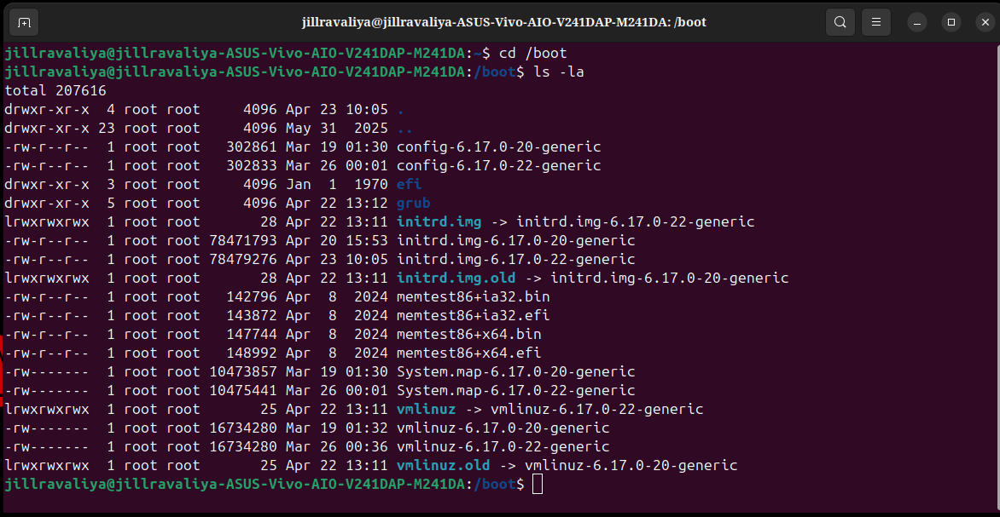
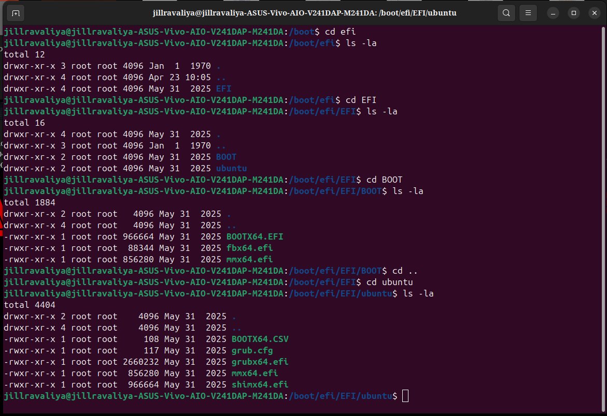
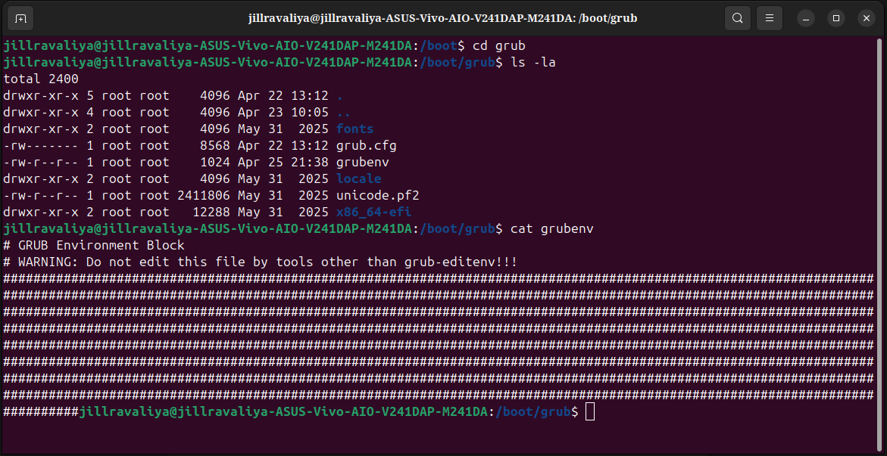

# The /boot Directory — A Deep Dive


> Ever wondered why your machine shows a blank screen before Linux loads? What `initrd.img` actually contains? Why `vmlinuz` is root-only but `initrd` isn't? Why Jan 1 1970 appears inside `/boot/efi/`?

**You're about to find out.**

---

## What is /boot?

`/boot` is where your machine's entire startup life lives. Before systemd, before your desktop, before anything you can see or interact with — this directory is what makes Linux possible. It sits on the **ext4 partition** of your SSD and is read by GRUB after GRUB itself crosses from the FAT32 EFI world into the Linux world.

---

## Section 1 — ls -la /boot (Live Output)



This is the full `/boot` directory from your machine. Let's read every single line carefully.

```
total 207616
drwxr-xr-x  4  root root       4096  Apr 23 10:05  .
drwxr-xr-x 23  root root       4096  May 31  2025  ..
-rw-r--r--  1  root root     302861  Mar 19 01:30  config-6.17.0-20-generic
-rw-r--r--  1  root root     302833  Mar 26 00:01  config-6.17.0-22-generic
drwxr-xr-x  3  root root       4096  Jan  1  1970  efi
drwxr-xr-x  5  root root       4096  Apr 22 13:12  grub
lrwxrwxrwx  1  root root         28  Apr 22 13:11  initrd.img -> initrd.img-6.17.0-22-generic
-rw-r--r--  1  root root   78471793  Apr 20 15:53  initrd.img-6.17.0-20-generic
-rw-r--r--  1  root root   78479276  Apr 23 10:05  initrd.img-6.17.0-22-generic
lrwxrwxrwx  1  root root         28  Apr 22 13:11  initrd.img.old -> initrd.img-6.17.0-20-generic
-rw-r--r--  1  root root     142796  Apr  8  2024  memtest86+ia32.bin
-rw-r--r--  1  root root     143872  Apr  8  2024  memtest86+ia32.efi
-rw-r--r--  1  root root     147744  Apr  8  2024  memtest86+x64.bin
-rw-r--r--  1  root root     148992  Apr  8  2024  memtest86+x64.efi
-rw-------  1  root root   10473857  Mar 19 01:30  System.map-6.17.0-20-generic
-rw-------  1  root root   10475441  Mar 26 00:01  System.map-6.17.0-22-generic
lrwxrwxrwx  1  root root         25  Apr 22 13:11  vmlinuz -> vmlinuz-6.17.0-22-generic
-rw-------  1  root root   16734280  Mar 19 01:32  vmlinuz-6.17.0-20-generic
-rw-------  1  root root   16734280  Mar 26 00:36  vmlinuz-6.17.0-22-generic
lrwxrwxrwx  1  root root         25  Apr 22 13:11  vmlinuz.old -> vmlinuz-6.17.0-20-generic
```

> **Notice:** Your machine now has kernels **6.17.0-20** and **6.17.0-22** — two upgrades from the earlier exploration which had 6.17.0-14 and 6.17.0-19. The system updated itself between then and now.

---

### Reading Every Column — Nothing is Random

```
lrwxrwxrwx  1  root  root  25  Apr 22 13:11  vmlinuz -> vmlinuz-6.17.0-22-generic
│            │  │     │     │   │              │           │
│            │  │     │     │   │              │           └── points TO this real file
│            │  │     │     │   │              └── this filename (the symlink)
│            │  │     │     │   └── date last modified
│            │  │     │     └── size in bytes
│            │  │     │         (for symlinks: length of the path string, not file size)
│            │  │     │         "vmlinuz-6.17.0-22-generic" = 25 characters = 25 bytes
│            │  │     └── group owner
│            │  └── user owner
│            └── hard link count
└── permissions: file-type + owner-perms + group-perms + other-perms
```

### Permission types decoded

| Symbol | Meaning |
|--------|---------|
| `d` | Directory |
| `-` | Regular file |
| `l` | Symlink |
| `r` | Read allowed |
| `w` | Write allowed |
| `x` | Execute (or enter directory) |
| `-` | That permission NOT given |

### Every file's permission from the screenshot — and WHY

```
lrwxrwxrwx   vmlinuz              ← symlink, 777: anyone can follow it
lrwxrwxrwx   vmlinuz.old          ← symlink, 777
lrwxrwxrwx   initrd.img           ← symlink, 777
lrwxrwxrwx   initrd.img.old       ← symlink, 777

-rw-------   vmlinuz-6.17.0-20    ← 600: root ONLY — kernel binary is sensitive
-rw-------   vmlinuz-6.17.0-22    ← 600: root ONLY
-rw-------   System.map-6.17.0-20 ← 600: root ONLY — memory addresses = security risk
-rw-------   System.map-6.17.0-22 ← 600: root ONLY

-rw-r--r--   initrd.img-6.17.0-20 ← 644: root write, everyone read
-rw-r--r--   initrd.img-6.17.0-22 ← 644: needed world-readable for early boot stages
-rw-r--r--   config-6.17.0-20     ← 644: just documentation, no harm in reading
-rw-r--r--   config-6.17.0-22     ← 644
-rw-r--r--   memtest86+*          ← 644: standalone programs, safe to read

drwxr-xr-x   efi/                 ← 755: directory, root writes, others can enter
drwxr-xr-x   grub/                ← 755: directory
```

**Why is vmlinuz root-only but initrd world-readable?**

`vmlinuz` holds compressed machine code. In the wrong hands, it can be analyzed for memory layout exploits (KASLR bypass, ROP chains). So root-only is a security decision.

`initrd.img` must be loaded at the earliest boot stage — before user permissions exist. The bootloader and early kernel need to read it. World-readable is a deliberate security vs. functionality tradeoff.

---

### The Naming Convention — Nothing is Random

Every filename follows a strict pattern:

```
vmlinuz-6.17.0-22-generic
         │  │ │  └── "generic" = standard Ubuntu kernel
         │  │ └───── 22 = ABI/patch number (22 > 20 = newer)
         │  └─────── 0 = minor version
         └────────── 6.17 = kernel version (Linux 6.17)
```

Three possible suffixes:
- `generic` — standard Ubuntu desktop/server kernel (your machine)
- `lowlatency` — for audio/real-time workloads
- `server` — no GUI drivers, optimized for headless servers

---

### Plain Names = Symlinks — Your Safety Net

From the screenshot:

```
initrd.img     → initrd.img-6.17.0-22-generic    (latest)
initrd.img.old → initrd.img-6.17.0-20-generic    (previous)
vmlinuz        → vmlinuz-6.17.0-22-generic        (latest)
vmlinuz.old    → vmlinuz-6.17.0-20-generic        (previous)
```

**Why symlinks and not just fixed filenames?**

GRUB's config says `linux /boot/vmlinuz`. When Ubuntu installs a new kernel, it just updates the symlink — GRUB never has to be reconfigured. The `.old` symlink is your lifeline: if 6.17.0-22 breaks, you can manually select 6.17.0-20 from the GRUB menu.

**What happens when the NEXT kernel update arrives:**

```
CURRENT (from screenshot):
  vmlinuz     → vmlinuz-6.17.0-22-generic   ← current latest
  vmlinuz.old → vmlinuz-6.17.0-20-generic   ← one behind

AFTER new kernel 6.17.0-25 gets installed:
  vmlinuz     → vmlinuz-6.17.0-25-generic   ← new latest
  vmlinuz.old → vmlinuz-6.17.0-22-generic   ← previous latest
  vmlinuz-6.17.0-20 gets DELETED             ← too old, disk freed
```

Ubuntu keeps only 2 kernels at a time by default. The oldest one gets deleted when a third arrives.

---

### The Timeline Story Hidden in the Dates

Every date in `ls -la` tells a story. Reading the screenshot carefully:

```
Apr  8  2024  → memtest86+ files (installed long ago, never updated — separate tool)

Mar 19 01:30  → config-6.17.0-20 and System.map-6.17.0-20
                 (upstream kernel 6.17.0-20 compiled at 1:30 AM on March 19)
Mar 19 01:32  → vmlinuz-6.17.0-20
                 (kernel binary built 2 minutes after compile — fast!)
Apr 20 15:53  → initrd.img-6.17.0-20
                 (NOT the same day as vmlinuz! initrd was rebuilt separately
                  by update-initramfs, possibly triggered by a driver update)

Mar 26 00:01  → config-6.17.0-22 and System.map-6.17.0-22
                 (kernel 6.17.0-22 compiled at midnight March 26)
Mar 26 00:36  → vmlinuz-6.17.0-22
                 (35 minutes after compile)
Apr 22 13:11  → symlinks updated (vmlinuz, vmlinuz.old, initrd.img, initrd.img.old)
                 ← THIS IS THE INSTALL DAY on YOUR machine
Apr 22 13:12  → grub/ directory modified = update-grub ran that same minute
Apr 23 10:05  → initrd.img-6.17.0-22 created
                 ← NEXT DAY! update-initramfs ran separately, morning after install
Apr 23 10:05  → . (current dir) modified = initrd creation changed /boot that day
Apr 25 21:38  → grubenv modified ← TODAY! You booted the machine today
```

**Key insight — vmlinuz and initrd dates are different:**

```
vmlinuz arrives as a .deb package from Canonical's build servers.
initrd is generated LOCALLY on your machine by update-initramfs,
pulling together drivers specific to YOUR hardware.

These are two separate events. The initrd can be rebuilt any time
without touching vmlinuz — and often is.
```

---

### Sizes Tell a Story

```
# config files — 28-byte difference
config-6.17.0-20-generic    302861 bytes
config-6.17.0-22-generic    302833 bytes
→ 28 bytes smaller: a config option removed or renamed between versions

# System.map — grew slightly
System.map-6.17.0-20-generic    10473857 bytes
System.map-6.17.0-22-generic    10475441 bytes
→ +1584 bytes: new functions added to kernel (more symbol table entries)

# vmlinuz — IDENTICAL!
vmlinuz-6.17.0-20-generic    16734280 bytes
vmlinuz-6.17.0-22-generic    16734280 bytes
→ Same byte count: rare coincidence, or same compression ratio output

# initrd — grew slightly
initrd.img-6.17.0-20-generic    78471793 bytes  (74.8 MB)
initrd.img-6.17.0-22-generic    78479276 bytes  (74.8 MB)
→ +7483 bytes: new drivers or firmware blobs added for 6.17.0-22

# memtest — unchanged since Apr 8 2024
memtest86+ia32.bin    142796  ← 32-bit, legacy BIOS
memtest86+ia32.efi    143872  ← 32-bit, UEFI
memtest86+x64.bin     147744  ← 64-bit, legacy BIOS
memtest86+x64.efi     148992  ← 64-bit, UEFI ← YOUR machine
# 64-bit EFI is slightly larger: UEFI protocol overhead
```

---

### total 207616 — What Does This Mean?

The very first line:

```
total 207616
```

This is in **512-byte blocks** (Unix standard unit):

```
207616 blocks × 512 bytes = 106,299,392 bytes ≈ 101 MB

That's the actual disk space /boot consumes on your ext4 partition.
```

Why does it differ from adding all file sizes? ext4 allocates in **4096-byte blocks**. Even a 25-byte symlink uses a full 4096-byte block on disk.

---

## Section 2 — /boot/efi/ Structure (Live Output)



This screenshot shows three levels explored in sequence: `/boot/efi/` → `/boot/efi/EFI/` → `/boot/efi/EFI/BOOT/` → `/boot/efi/EFI/ubuntu/`.

---

### /boot/efi/ — The Partition Bridge

```
jillravaliya@.../boot$ cd efi
jillravaliya@.../boot/efi$ ls -la

total 12
drwxr-xr-x  3  root root  4096  Jan  1  1970  .
drwxr-xr-x  4  root root  4096  Apr 23 10:05  ..
drwxr-xr-x  4  root root  4096  May 31  2025  EFI
```

Only one thing here: the `EFI` folder.

**The Jan 1 1970 date on `.` (the current directory):**

This is the Unix epoch — time zero. The `/boot/efi/` directory lives on a **FAT32 partition** (your EFI System Partition). FAT32 doesn't track modification times the same way ext4 does. When Linux mounts a FAT32 filesystem, the mount-point directory can show epoch zero if the FAT32 partition never received a proper timestamp write. This is **completely normal — not a bug, not corruption.**

**Physical reality of what you're standing in:**

```
Your NVMe SSD has two partitions:
┌──────────────────────────────────────────────┐
│                 NVMe SSD                     │
│                                              │
│  /dev/nvme0n1p1           /dev/nvme0n1p2     │
│  ┌──────────────────┐  ┌──────────────────┐  │
│  │ FAT32  ~512 MB   │  │ ext4             │  │
│  │                  │  │                  │  │
│  │ Mounted at:      │  │ Mounted at: /    │  │
│  │ /boot/efi/       │  │                  │  │
│  │                  │  │ Contains:        │  │
│  │ UEFI reads this  │  │ /boot/grub/      │  │
│  │ directly (FAT32  │  │ /boot/vmlinuz    │  │
│  │ is in UEFI ROM)  │  │ /home/jill.../   │  │
│  └──────────────────┘  └──────────────────┘  │
└──────────────────────────────────────────────┘
```

When you `cd /boot/efi`, you literally walk from ext4 into FAT32. Linux makes it seamless via mount.

---

### /boot/efi/EFI/ — The UEFI Namespace

```
jillravaliya@.../boot/efi$ cd EFI
jillravaliya@.../boot/efi/EFI$ ls -la

total 16
drwxr-xr-x  4  root root  4096  May 31  2025  .
drwxr-xr-x  3  root root  4096  Jan  1  1970  ..
drwxr-xr-x  2  root root  4096  May 31  2025  BOOT
drwxr-xr-x  2  root root  4096  May 31  2025  ubuntu
```

Two subdirectories: `BOOT` and `ubuntu`. Both dated **May 31 2025** — the day Ubuntu was installed on your machine. This timestamp is frozen in FAT32 and will never change unless you reinstall.

**Why two folders?**

```
EFI/BOOT/    = universal fallback
               The UEFI specification says EVERY UEFI computer in the world
               must know how to find EFI/BOOT/BOOTX64.EFI
               Used when registered boot entries fail

EFI/ubuntu/  = Ubuntu's registered boot entry (preferred path)
               Stored in UEFI NVRAM: "Boot0001: ubuntu → /EFI/ubuntu/shimx64.efi"
               Used on every normal boot
```

UEFI boot priority:
```
1. Try EFI/ubuntu/shimx64.efi     ← registered in NVRAM (preferred)
2. Try EFI/BOOT/BOOTX64.EFI      ← universal fallback
3. "No bootable device found"     ← both paths broken
```

---

### /boot/efi/EFI/BOOT/ — The Universal Fallback

```
jillravaliya@.../boot/efi/EFI$ cd BOOT
jillravaliya@.../boot/efi/EFI/BOOT$ ls -la

total 1884
drwxr-xr-x  2  root root    4096  May 31  2025  .
drwxr-xr-x  4  root root    4096  May 31  2025  ..
-rwxr-xr-x  1  root root  966664  May 31  2025  BOOTX64.EFI
-rwxr-xr-x  1  root root   88344  May 31  2025  fbx64.efi
-rwxr-xr-x  1  root root  856280  May 31  2025  mmx64.efi
```

`total 1884` blocks × 512 = ~942 KB. The entire universal fallback system fits under 1 MB.

**Permissions `-rwxr-xr-x`:** All three files have the execute bit set. EFI files are executables — UEFI runs them directly. The `x` bit is required.

#### BOOTX64.EFI — 966,664 bytes

```
Check the size: 966664 bytes

Now look at EFI/ubuntu/shimx64.efi: also 966664 bytes

IDENTICAL. BOOTX64.EFI IS shimx64.efi.
Ubuntu copies its shim to two locations:
  EFI/ubuntu/shimx64.efi  ← preferred registered path
  EFI/BOOT/BOOTX64.EFI    ← universal fallback path
Same binary. Two paths. Belt and suspenders.

If EFI/ubuntu/ entry gets deleted from UEFI NVRAM:
  UEFI falls back to EFI/BOOT/BOOTX64.EFI
  Finds the shim
  Boot continues normally
  You never even notice
```

#### fbx64.efi — 88,344 bytes (tiny!)

Fallback Boot Manager. Its 86 KB size reflects its simple, single job:

```
Scenario: BIOS/firmware update wiped your UEFI boot entries
          (this happens occasionally with aggressive firmware updates)

Without fbx64.efi:
  UEFI: "no registered boot entries"
  Machine shows: "No bootable device found" 

With fbx64.efi:
  UEFI falls back to EFI/BOOT/BOOTX64.EFI
  fbx64.efi runs:
    → scans entire EFI partition
    → finds all .efi bootloaders
    → re-registers them in UEFI NVRAM
    → "Ubuntu" appears in boot menu again 
    → next boot is normal

Think of it as: the auto-repair tool for corrupted boot registrations.
```

#### mmx64.efi — 856,280 bytes

MOK Manager (Machine Owner Key). At 836 KB it's larger because it needs a full interactive UI:

```
PROBLEM:
  UEFI Secure Boot: trusts ONLY Microsoft-signed code
  Your custom kernel module: NOT signed by Microsoft
  Your DKMS driver (VirtualBox, NVIDIA proprietary): NOT signed
  → They would be BLOCKED from loading

SOLUTION — MOK (Machine Owner Key):
  You generate your own RSA key pair
  You sign your code with your private key
  mmx64.efi lets you enroll your PUBLIC key into UEFI's trust store

Enrollment flow:
  1. Run: sudo mokutil --import my-key.der
  2. Set a password when prompted
  3. Reboot
  4. Blue "Perform MOK management" screen appears (this IS mmx64.efi running)
  5. Select "Enroll MOK"
  6. Type the password you set
  7. Key enrolled in UEFI NVRAM 
  8. System reboots into Ubuntu normally
  9. Your signed custom code now loads without Secure Boot blocking it

Who needs this:
  - Kernel developers compiling custom kernels
  - DKMS module users (VirtualBox, NVIDIA, ZFS)
  - People patching and signing their own kernel modules
```

All three files dated **May 31 2025** = installation day. They don't change between kernel updates.

---

### /boot/efi/EFI/ubuntu/ — The Real Boot Chain

```
jillravaliya@.../boot/efi/EFI$ cd ubuntu
jillravaliya@.../boot/efi/EFI/ubuntu$ ls -la

total 4404
drwxr-xr-x  2  root root       4096  May 31  2025  .
drwxr-xr-x  4  root root       4096  May 31  2025  ..
-rwxr-xr-x  1  root root        108  May 31  2025  BOOTX64.CSV
-rwxr-xr-x  1  root root        117  May 31  2025  grub.cfg
-rwxr-xr-x  1  root root    2660232  May 31  2025  grubx64.efi
-rwxr-xr-x  1  root root     856280  May 31  2025  mmx64.efi
-rwxr-xr-x  1  root root     966664  May 31  2025  shimx64.efi
```

`total 4404` blocks × 512 = ~2.2 MB. The entire Ubuntu bootloader chain — every piece needed to get Linux running — fits in 2.2 MB.

The sizes tell the story of complexity:

```
BOOTX64.CSV       108 bytes  ← pure text: one line describing the boot entry
grub.cfg          117 bytes  ← pure text: 3 lines that bridge FAT32 to ext4
mmx64.efi     856,280 bytes  ← MOK manager: needs full interactive UI
shimx64.efi   966,664 bytes  ← shim: needs embedded Microsoft signature + MOK logic
grubx64.efi 2,660,232 bytes  ← full GRUB bootloader: does the real work = biggest
```

All dated **May 31 2025** = installation day. Unlike `/boot/grub/grub.cfg` which regenerates on every `update-grub`, these EFI files are static after installation.

#### BOOTX64.CSV — 108 bytes

A plain text file. Tells UEFI the human-readable name for this boot entry:

```
ubuntu,\EFI\ubuntu\shimx64.efi,Ubuntu
```

This is what UEFI shows in its boot menu as the entry label.

#### grub.cfg — 117 bytes (The Bridge File)

The smallest grub.cfg. It bridges the FAT32 world to the ext4 world:

```bash
search.fs_uuid d563d94d-89c0-4ce4-99b7-39382f0bb311 root
set prefix=($root)'/boot/grub'
configfile $prefix/grub.cfg
```

Three lines. Three missions:

```
Line 1: search.fs_uuid d563d94d-... root
  GRUB searches ALL partitions on ALL drives
  Finds the one with UUID d563d94d-...
  That's your ext4 Linux partition
  Names it "root" internally

Line 2: set prefix=($root)'/boot/grub'
  prefix = where GRUB looks for its modules and configs
  ($root) = the ext4 partition just found
  Full resolved path = /dev/nvme0n1p2/boot/grub

Line 3: configfile $prefix/grub.cfg
  GRUB loads and executes /boot/grub/grub.cfg from ext4
  This is the full config with all kernel entries and menu
  ← GRUB has now crossed from FAT32 into ext4

The 117-byte file is a treasure map.
The treasure is /boot/grub/grub.cfg.
```

#### shimx64.efi — 966,664 bytes (The Trusted Middleman)

```
PROBLEM:
UEFI Secure Boot: "I only run code signed by Microsoft"
GRUB (grubx64.efi): NOT signed by Microsoft → would be blocked!

SOLUTION — The Shim:
Ubuntu went to Microsoft: "Please sign our tiny shim loader"
Microsoft reviewed it and signed it 

Boot chain with Secure Boot enabled:

┌─────────────────────────────────┐
│  UEFI Firmware                  │
│  Trust store: Microsoft         │
└────────────────┬────────────────┘
                 │ verifies signature
                 ↓
┌─────────────────────────────────┐
│  shimx64.efi                    │ ← SIGNED BY MICROSOFT 
│  Has its OWN trust store:       │
│  • Ubuntu signing key           │
│  • Your MOK keys                │
└────────────────┬────────────────┘
                 │ verifies signature
                 ↓
┌─────────────────────────────────┐
│  grubx64.efi                   │ ← SIGNED BY UBUNTU 
└────────────────┬────────────────┘
                 │ reads 117-byte grub.cfg
                 ↓
          finds ext4 partition
                 ↓
┌─────────────────────────────────┐
│  /boot/grub/grub.cfg (full)    │ ← the real boot config
└────────────────┬────────────────┘
                 │ loads
                 ↓
┌─────────────────────────────────┐
│  vmlinuz + initrd.img          │ ← kernel + mini-filesystem
└────────────────┬────────────────┘
                 ↓
              Linux 🐧
```

#### grubx64.efi — 2,660,232 bytes (The Real Bootloader)

At 2.6 MB, the largest file in the EFI directory — it does the most work:
- Reads grub.cfg files (both tiny one and full one)
- Draws the boot menu on screen (fonts, colors, timing)
- Loads GRUB modules: `nvme.mod`, `ext2.mod`, `part_gpt.mod`
- Reads vmlinuz and initrd.img from ext4
- Passes all kernel parameters
- Hands control to the kernel

This IS GRUB, compiled specifically for 64-bit UEFI (`x86_64-efi`).

---

## Section 3 — /boot/grub/ and grubenv (Live Output)



---

### /boot/grub/ — GRUB's Full World on ext4

```
jillravaliya@.../boot$ cd grub
jillravaliya@.../boot/grub$ ls -la

total 2400
drwxr-xr-x  5  root root      4096  Apr 22 13:12  .
drwxr-xr-x  4  root root      4096  Apr 23 10:05  ..
drwxr-xr-x  2  root root      4096  May 31  2025  fonts
-rw-------  1  root root      8568  Apr 22 13:12  grub.cfg
-rw-r--r--  1  root root      1024  Apr 25 21:38  grubenv
drwxr-xr-x  2  root root      4096  May 31  2025  locale
-rw-r--r--  1  root root   2411806  May 31  2025  unicode.pf2
drwxr-xr-x  2  root root     12288  May 31  2025  x86_64-efi
```

**Dates tell a clear story:**

```
May 31  2025  → fonts/, locale/, unicode.pf2, x86_64-efi/
               Installed once. Never touched.
               Static resources: fonts, language files, GRUB modules.

Apr 22 13:12  → grub.cfg and . (current dir)
               April 22 = kernel 6.17.0-22 install day
               update-grub ran and regenerated grub.cfg (same minute as symlinks)

Apr 25 21:38  → grubenv ← TODAY
               You booted today and grubenv was written:
               recordfail=1 set at boot start, cleared after successful boot
               The cleared state leaves only the header → shown as ###### in cat
```

---

### grub.cfg — 8,568 bytes

**Permission: `-rw-------`** — root read/write ONLY. This is unusual. grub.cfg contains exact kernel command lines, UUIDs, and sometimes security-relevant parameters. Restrictive permissions prevent casual tampering.

**Critical rule — never edit this file directly:**

```
 /boot/grub/grub.cfg is AUTO-GENERATED

Any edits get OVERWRITTEN the next time update-grub runs.
update-grub runs automatically on every kernel install/remove.

Correct workflow:
  /etc/default/grub        ← edit this for timeout, theme, kernel params
  /etc/grub.d/40_custom    ← edit this for custom menu entries
  sudo update-grub         ← regenerates /boot/grub/grub.cfg
```

**The generation chain:**

```
/etc/default/grub          (your settings)
    +
/etc/grub.d/ scripts:
    00_header               → GRUB's variables, functions, recordfail logic
    05_debian_theme         → colors and theme settings
    10_linux                → scans /boot, generates one entry per kernel
    20_memtest86+           → generates memtest entry
    30_uefi-firmware        → generates UEFI settings entry
    40_custom               → your custom additions (safe to hand-edit)
    ↓
grub-mkconfig (run by update-grub)
    ↓
/boot/grub/grub.cfg        (8568 bytes output)
```

**Why 8568 bytes?** Two kernels × 2 entries each (normal + recovery mode) + header section + memtest + UEFI settings entry + functions = ~200 lines ≈ 8568 bytes.

**Inside grub.cfg — the 6 sections:**

```
### BEGIN /etc/grub.d/00_header ###
  set timeout=10
  set default=0
  function recordfail { ... }     ← sets recordfail=1 before every boot
  if [ "${recordfail}" = 1 ];     ← if last boot failed: timeout=30
    then set timeout=30
  fi
  ...GRUB's brain...

### BEGIN /etc/grub.d/05_debian_theme ###
  Colors, backgrounds, theme settings

### BEGIN /etc/grub.d/10_linux ###  ← THE MOST IMPORTANT SECTION
  menuentry 'Ubuntu' {
    recordfail                      ← written FIRST before kernel loads
    linux  /boot/vmlinuz-6.17.0-22-generic root=UUID=d563d94d-... ro quiet splash
    initrd /boot/initrd.img-6.17.0-22-generic
  }
  menuentry 'Ubuntu (recovery)' { ... }
  menuentry 'Ubuntu 6.17.0-20' { ... }    ← previous kernel
  menuentry 'Ubuntu 6.17.0-20 (recovery)' { ... }

### BEGIN /etc/grub.d/20_memtest86+ ###
  menuentry 'Memory test (memtest86+)' { ... }

### BEGIN /etc/grub.d/30_uefi-firmware ###
  menuentry 'UEFI Firmware Settings' { ... }    ← "go to BIOS" from GRUB!

### END /etc/grub.d/40_custom ###
```

**The kernel command line decoded:**

```
linux /boot/vmlinuz-6.17.0-22-generic \
      root=UUID=d563d94d-89c0-4ce4-99b7-39382f0bb311 \
      ro quiet splash amdgpu.dc=1 $vt_handoff

Parameter           What it does
─────────────────────────────────────────────────────
root=UUID=d563d94d  "your root filesystem has this UUID"
ro                  mount / as read-only first (safety — no corruption if crash)
quiet               suppress kernel boot messages (clean screen)
splash              show Ubuntu logo/animation instead of text
amdgpu.dc=1         enable AMD display core — specific to your Radeon GPU
$vt_handoff         smooth terminal handoff: no screen flicker GRUB→Linux
```

**The recordfail safety mechanism:**

```
GRUB selects Ubuntu entry from menu
  → recordfail() called IMMEDIATELY (before kernel even loads)
  → recordfail=1 written to grubenv
  → then kernel starts loading

If kernel crashes:
  recordfail=1 is already in grubenv
  next reboot: GRUB shows menu with 30 SECOND timeout
  "you have time to select the previous working kernel"

If kernel boots successfully:
  during startup, Linux's grub-common package clears recordfail
  next reboot: normal 10 second timeout
  system acts healthy

This is why after the kernel panic bug, GRUB showed 30 seconds!
```

**The initrdfail mechanism:**

```bash
# In 00_header section of grub.cfg:
if [ "${initrdfail}" = 2 ]; then
   set initrdfail=
elif [ "${initrdfail}" = 1 ]; then
   set next_entry="${prev_entry}"
   ...
fi
```

```
initrdfail values:
  0 or unset  = no initrd failure
  1           = initrd failed → try PREVIOUS kernel next boot
  2           = already tried recovery → reset, let user choose manually

During the Bug #2141741 kernel panic:
  initrd.img-6.17.0-14 didn't exist
  GRUB tried to load it → file not found
  But 55-initrd.install returned exit 0 (SUCCESS!)
  So initrdfail was NEVER set to 1
  The safety net was bypassed before it could catch the problem
  → kernel started without initrd → no NVMe driver → panic every boot
```

---

### grubenv — 1,024 bytes, dated Apr 25 21:38

**Permission: `-rw-r--r--`** — world-readable (unlike grub.cfg). GRUB itself runs before any user exists and must be able to read this. Some system tools also check it without root. No security risk since it just stores boot state variables.

**Dated TODAY (Apr 25 21:38)** — from your most recent boot. GRUB wrote `recordfail=1` at boot start, kernel cleared it after successful startup.

---

### cat grubenv — The Full Output Explained

```bash
jillravaliya@.../boot/grub$ cat grubenv

# GRUB Environment Block
# WARNING: Do not edit this file by tools other than grub-editenv!!!
########################################################################
########################################################################
########################################################################
########################################################################
########################################################################
########################################################################
########################################################################
#########jillravaliya@...:/boot/grub$
```

**What you see = perfectly healthy system.**

All `#` after the header = no variables stored = last boot was 100% successful = all flags cleared.

**Why exactly 1024 bytes — the deep reason:**

```
grubenv is ALWAYS exactly 1024 bytes. Non-negotiable.

Why?
GRUB reads this file at the very earliest boot stage, before
filesystem drivers are fully loaded. Reading a fixed-size block
is simpler, faster, and safer than a variable-size file.
No need to calculate file size. No need for full filesystem support.
Just: "read 1024 bytes from this disk location." Done.

Structure of the 1024 bytes:
  Bytes 0-29:    "# GRUB Environment Block\n"
  Bytes 30-80:   "# WARNING: Do not edit...\n"
  Bytes 81-1023: either variables OR '#' padding characters

When a variable is written:
  "recordfail=1\n" replaces the '#' characters at the front
  Rest stays as '#'

When a variable is deleted:
  Its text is REPLACED with '#' characters
  File stays exactly 1024 bytes
  No shifting, no resizing, no rewriting

This is why you CANNOT use regular text editors on grubenv.
Only grub-editenv knows this protocol. That warning in the file is serious.
```

**What grubenv looks like after a failed boot:**

```bash
sudo grub-editenv /boot/grub/grubenv list

# Output after a failed boot:
recordfail=1          ← boot attempt started but didn't complete cleanly
saved_entry=0         ← it tried menu entry 0 (the newest kernel)
initrdfail=1          ← initrd failed to load
next_entry=1          ← GRUB will try entry 1 next (previous kernel)
```

**Commands to work with grubenv safely:**

```bash
# Read all stored variables
sudo grub-editenv /boot/grub/grubenv list

# Verify it's always exactly 1024 bytes
wc -c /boot/grub/grubenv
# 1024 /boot/grub/grubenv

# Manually set a variable
sudo grub-editenv /boot/grub/grubenv set saved_entry=1

# Delete a variable
sudo grub-editenv /boot/grub/grubenv unset recordfail

# Never use echo or text editors on this file!
```

---

### fonts/ — GRUB's Typography

```
drwxr-xr-x  2  root root  4096  May 31  2025  fonts/
```

Contains `unicode.pf2` — the same file as in the grub root. GRUB's `loadfont` command looks here first. Explanation below.

---

### unicode.pf2 — 2,411,806 bytes

```
pf2 = GRUB's own font format
      (not TrueType, not OpenType — GRUB invented its own)

unicode = covers ALL 140,000+ Unicode characters:
  Latin, Cyrillic, Arabic, Chinese, Japanese, Korean,
  Hebrew, Devanagari (Hindi), Thai, Greek, emoji...

Why 2.3 MB?
  Each character = bitmap image at each pixel size
  Multiple sizes for different screen resolutions
  140,000 characters × multiple sizes = 2.3 MB
  Actually incredibly efficient given the coverage.
```

**Why two copies?**

```
/boot/grub/fonts/unicode.pf2    ← fonts subdirectory (primary location)
/boot/grub/unicode.pf2          ← grub root (legacy location)

Different GRUB versions look in different default paths.
Having both = maximum compatibility.
Same file content, two locations.
Costs ~2.3 MB extra disk but guarantees fonts always load.
```

---

### locale/ — Language Support

```
drwxr-xr-x  2  root root  4096  May 31  2025  locale/
```

Contains `.mo` files (Message Object — compiled gettext translation files):

```
locale/
├── en.mo    ← English
├── hi.mo    ← Hindi
├── fr.mo    ← French
... and more
```

GRUB uses these to display its messages in your system language. Since GRUB runs before Linux, it has its own independent translation system — it cannot use the Linux locale system that hasn't started yet.

---

### x86_64-efi/ — GRUB's Module Toolbox

```
drwxr-xr-x  2  root root  12288  May 31  2025  x86_64-efi/
```

`12288 bytes for the directory listing itself` — this signals a LOT of files inside (ext4 needs more space to store all the filenames). Inside: 250+ `.mod` files.

Just like the Linux kernel has `.ko` modules, GRUB has `.mod` modules. Loaded into GRUB memory only when needed.

**The three modules actually loaded on your boot:**

```
insmod nvme       → talks to NVMe SSD hardware (Layer 1)
insmod part_gpt   → reads GPT partition table (Layer 2)
insmod ext2       → reads ext4 filesystem (Layer 3)
                    ↓
              vmlinuz + initrd loaded! (Layer 4)
```

Without any one of these, GRUB cannot read your kernel file.

**Other modules available (selected highlights):**

```
# Display
efi_gop.mod      ← EFI Graphics Output Protocol (modern display)
gfxterm.mod      ← graphical terminal for pretty boot screen
vbe.mod          ← VESA fallback (older display)

# Storage
ahci.mod         ← SATA drives
nvme.mod         ← NVMe SSD
usb_storage.mod  ← boot from USB
lvm.mod          ← LVM logical volumes
raid.mod         ← software RAID

# Filesystems
ext2.mod         ← ext2/3/4 (all three!)
ntfs.mod         ← Windows NTFS (dual boot support)
fat.mod          ← FAT32/16
hfsplus.mod      ← Apple HFS+ (helps boot macOS!)
btrfs.mod        ← Btrfs
zfs.mod          ← ZFS
xfs.mod          ← XFS

# Network (GRUB has full network stack!)
net.mod          ← core network
efinet.mod       ← EFI network card
tftp.mod         ← download kernel from server
http.mod         ← GRUB has an HTTP client!
dns.mod          ← GRUB can resolve domain names!
pxe.mod          ← PXE network boot (used heavily in data centers)

# Encryption (GRUB can unlock encrypted drives!)
gcry_aes.mod     ← AES encryption
luks.mod         ← LUKS disk encryption
luks2.mod        ← LUKS2
password.mod     ← password-protect the GRUB menu itself

# Input
usb_keyboard.mod ← USB keyboard (without this: can't type at GRUB!)
at_keyboard.mod  ← PS/2 keyboard

# Scripting
lua.mod          ← Lua scripting language INSIDE GRUB
regexp.mod       ← regular expressions in GRUB scripts
```

**Why GRUB has its own NVMe driver AND the kernel has its own — and they cannot share:**

```
GRUB's nvme.mod:
  Written for GRUB's internal API
  Runs in GRUB's memory space
  Purpose: read vmlinuz + initrd from disk
  Dies when GRUB hands control to kernel (memory overwritten)

Kernel's nvme.ko (inside initrd):
  Written for the Linux kernel API
  Runs in kernel's memory space
  Purpose: mount the real / filesystem
  Lives for the entire kernel runtime

When GRUB hands off to kernel:
  GRUB memory → overwritten by kernel image
  nvme.mod → gone, destroyed
  Kernel starts completely alone
  Needs ITS OWN NVMe driver
  Gets it from initrd.img

They are:
  Different code (different authors, different projects)
  Different APIs (GRUB API vs Linux kernel driver API)
  Different memory management models
  Incompatible by design — intentionally
```

---

## Deep Dive: vmlinuz

### What the name means

```
vm    = virtual memory (kernel manages virtual memory for all processes)
linu  = linux
z     = compressed (originally gzip; modern kernels use zstd)
```

### What's inside

vmlinuz is a self-extracting compressed archive:

```
[vmlinuz on disk — 16,734,280 bytes]
    │
    └── zstd compressed blob
        │
        └── [decompressed kernel in RAM — ~50-100 MB]
            ├── .text  (T) ← machine code: schedule(), printk(), do_fork()
            ├── .rodata(R) ← constants: "Kernel panic — not syncing"
            ├── .data  (D) ← initialized globals: int maxProcs = 32768;
            ├── .bss   (B) ← uninitialized globals: int counter; (zeroed at boot)
            └── built-in drivers (CONFIG=y ones: CONFIG_ATA=y lives here)
```

### Memory layout when running

```
RAM (high → low address):
┌────────────────────────┐
│ Stack  (dynamic)       │ ← function calls, local vars; changes every microsecond
│ (grows downward ↓)     │   NOT in System.map (no fixed address)
├────────────────────────┤
│ Heap   (dynamic)       │ ← kmalloc(), vmalloc(); changes constantly
│ (grows upward ↑)       │   NOT in System.map
├────────────────────────┤
│ BSS    (B) (static)    │ ← global: int counter;  → starts at 0
│                        │   fixed address → IN System.map
├────────────────────────┤
│ Data   (D) (static)    │ ← global: int max = 32768;
│                        │   fixed address → IN System.map
├────────────────────────┤
│ Text   (T) (static)    │ ← CPU instructions: schedule(), printk()
│ Rodata (R) (static)    │ ← constants (hardware write-protected)
│                        │   fixed addresses → IN System.map
└────────────────────────┘
```

**BSS vs Stack — most confused pair:**
- Stack: born when function starts, dies when function returns. No fixed address. Cannot be in System.map.
- BSS: born when kernel boots, lives forever. Zero-initialized. Fixed address. In System.map.

**Rodata write protection:** If ANYTHING tries to write to the `.rodata` segment, the CPU triggers a protection fault → kernel panic immediately. This is a security feature — constant strings cannot be secretly modified.

---

## Deep Dive: initrd.img

### The chicken-and-egg problem

```
Kernel needs NVMe driver to mount /
NVMe driver (nvme.ko) lives on the / partition
/ is on NVMe which the kernel can't see without the driver
→ DEADLOCK
```

initrd (initial RAM disk) breaks this. GRUB loads it into RAM before handing control to the kernel. The kernel boots inside this tiny RAM filesystem, loads the NVMe driver, mounts the real `/`, then switches.

### Why NVMe needs initrd but SATA doesn't

```
grep CONFIG_BLK_DEV_NVME /boot/config-$(uname -r)
  CONFIG_BLK_DEV_NVME=m    ← MODULE: not in vmlinuz, must come from initrd

grep "^CONFIG_ATA=" /boot/config-$(uname -r)
  CONFIG_ATA=y             ← BUILT-IN: always in vmlinuz, no initrd needed
```

NVMe is `=m` because not every machine has NVMe. SATA is `=y` because nearly everything needs it.

### Inside initrd (mini Linux in RAM)

```
initrd filesystem (temporarily mounted as / in RAM):
├── init               ← first script executed (the entry point)
├── bin/               ← busybox: tiny shell + core utilities
├── lib/modules/6.17.0-22-generic/kernel/drivers/nvme/
│   ├── nvme-core.ko.zst   ← NVMe core driver
│   └── nvme.ko.zst        ← NVMe PCI interface driver
└── scripts/
    ├── init-top/          ← stage 1: very first actions
    ├── init-premount/     ← stage 2: load NVMe driver HERE ← the critical moment
    ├── local-top/         ← stage 3: find root partition by UUID
    ├── local-premount/    ← stage 4: fsck if needed
    ├── local-bottom/      ← stage 5: post-mount
    └── init-bottom/       ← stage 6: exec /sbin/init (systemd)
```

### Boot flow inside initrd

```
GRUB loads vmlinuz and initrd into RAM
Hands control to kernel
Kernel mounts initrd as temporary /
Runs /init script:
  init-premount/ → loads nvme-core.ko.zst
                   loads nvme.ko.zst
                   NVMe driver active!
                   SSD visible as /dev/nvme0n1
  local-top/ → searches for UUID d563d94d-89c0-4ce4-99b7-39382f0bb311
               Finds it on /dev/nvme0n1p2
               Mounts real ext4 / ← THE CRITICAL MOMENT
  init-bottom/ → exec /sbin/init → systemd takes over
Full Linux! 
```

---

## Deep Dive: System.map

Root-only (`-rw-------`) because it contains the memory address of every kernel function — sensitive for security.

```
System.map-6.17.0-22-generic (sample entries):
  ffffffffa1234500 T printk
  ffffffffa1289000 T schedule
  ffffffffa1301200 T do_fork
  ffffffffa1445600 T tcp_connect
  ffffffffa1500000 R kernel_version  ← read-only constant
  ffffffffa2000000 D jiffies         ← initialized data
  ffffffffa3000000 B init_task       ← BSS: global, starts zeroed
```

**Letter codes:**

| Letter | Segment | Meaning |
|--------|---------|---------|
| T | Text | Executable function code |
| R | Read-only | Constants, string literals |
| D | Data | Initialized global variables |
| B | BSS | Uninitialized globals (zeroed) |

System.map grew by **+1584 bytes** from 6.17.0-20 to 6.17.0-22 — new functions were added to the kernel in that update.

**How it helps crash debugging:**
```
Kernel crash: "oops at ffffffffa1289000"
Look up System.map: ffffffffa1289000 = schedule()
schedule() = task switching code
Developer: "bug is somewhere in task switching!"
```

---

## Deep Dive: config-*

295 KB of kernel build answers:

```
CONFIG_BLK_DEV_NVME=m    ← NVMe = module → needs initrd
CONFIG_ATA=y             ← SATA = built-in → no initrd needed
CONFIG_USB=y             ← USB built-in
CONFIG_BLUETOOTH=m       ← Bluetooth = module
CONFIG_64BIT=y           ← 64-bit kernel
CONFIG_SWAP=y            ← swap space supported
CONFIG_XFS_FS=n          ← XFS not included at all
CONFIG_SECURITY=y        ← security framework enabled
```

| Value | Meaning | Lives in |
|-------|---------|---------|
| `y` | Baked into vmlinuz | Inside vmlinuz itself |
| `m` | Separate .ko.zst file | /lib/modules/kernel-version/ |
| `n` | Not included | Nowhere — doesn't exist |

World-readable because it's pure documentation with no security risk.

---

## Deep Dive: memtest86+

Four variants, all from Apr 8 2024:

```
memtest86+ia32.bin    142796  ← 32-bit, legacy BIOS
memtest86+ia32.efi    143872  ← 32-bit, UEFI
memtest86+x64.bin     147744  ← 64-bit, legacy BIOS
memtest86+x64.efi     148992  ← 64-bit, UEFI ← YOUR machine uses this
```

A completely separate program. GRUB boots it INSTEAD of Linux. Takes over the entire machine:

```
Writes pattern to every RAM cell: 10101010, 11001100, 11110000...
Reads them back
If read ≠ written → that cell is broken 

Errors = 0 → RAM is healthy 
Errors > 0 → that RAM stick is failing  → replace it
```

The Apr 8 2024 date means it was installed during the initial Ubuntu setup and has never been updated — it's a standalone tool not tied to kernel updates.

---

## The Complete Boot Flow

### Phase 1: Hardware (before any software)

```
Power ON
  ↓
CPU wakes at address 0xFFFFFFF0 (reset vector — burned in silicon)
  ↓
UEFI firmware starts from ROM chip (via SPI bus)
L2 cache used as fake RAM (CAR mode) — real RAM not ready yet
  ↓
UEFI initializes DDR RAM sticks
  ↓
POST: CPU arithmetic, RAM cells, PCI bus devices all checked
  NVMe SSD → /dev/nvme0n1
  AMD GPU  → /sys/bus/pci/devices/...
  USB      → /sys/bus/usb/devices/...
  ↓
UEFI finds EFI System Partition (FAT32, built-in UEFI FAT driver)
```

### Phase 2: Bootloader Chain

```
UEFI executes shimx64.efi (Microsoft-signed)
  ↓
shim executes grubx64.efi (Ubuntu-signed)
  ↓
GRUB reads 117-byte grub.cfg from FAT32:
  "Find UUID d563d94d → load /boot/grub/grub.cfg"
  ↓
GRUB loads nvme.mod + part_gpt.mod + ext2.mod
NOW GRUB CAN READ EXT4 ← FAT32→ext4 bridge crossed
  ↓
GRUB reads full /boot/grub/grub.cfg from ext4
Shows menu (or auto-boots after timeout)
  ↓
GRUB loads vmlinuz-6.17.0-22-generic into RAM
GRUB loads initrd.img-6.17.0-22-generic into RAM
GRUB hands control to kernel
GRUB memory overwritten — GRUB is dead
```

### Phase 3: Kernel + initrd

```
Kernel starts from vmlinuz
Mounts initrd as temporary / in RAM
  init-premount/ → loads nvme.ko → SSD visible!
  local-top/     → finds UUID d563d94d → mounts real /
  init-bottom/   → exec /sbin/init (systemd)
```

### Phase 4: systemd

```
systemd starts (PID 1)
Starts all services in parallel
Login screen 
```

### Hardware → Linux path map

| Hardware | Linux Path |
|---------|-----------|
| UEFI ROM chip | `/sys/firmware/efi/` |
| UEFI variables (NVRAM) | `/sys/firmware/efi/efivars/` |
| DMI/hardware info | `/sys/firmware/dmi/` |
| CPU | `/proc/cpuinfo` |
| RAM | `/proc/meminfo` |
| Whole SSD | `/dev/nvme0n1` |
| FAT32 partition | `/dev/nvme0n1p1` → mounted at `/boot/efi/` |
| ext4 partition | `/dev/nvme0n1p2` → mounted at `/` |
| Boot order | `/sys/firmware/efi/efivars/BootOrder-*` |
| Kernel command line (this boot) | `/proc/cmdline` |
| RAM memory map | `/proc/iomem` |

---

## The UUID — One Identity Across All Layers

`d563d94d-89c0-4ce4-99b7-39382f0bb311` appears at every layer:

```
Layer 1 — GRUB on FAT32:
  /boot/efi/EFI/ubuntu/grub.cfg:
  "search.fs_uuid d563d94d-..." → finds ext4 partition

Layer 2 — GRUB on ext4:
  /boot/grub/grub.cfg:
  "root=UUID=d563d94d-..." → tells kernel where / lives

Layer 3 — Kernel:
  /etc/fstab:
  "UUID=d563d94d-... / ext4 defaults 0 1" → mounts /

Layer 4 — Running system:
  lsblk -f → shows nvme0n1p2 UUID=d563d94d-...
```

Three programs. One UUID. One truth.

**Why not `/dev/sda1`?**

```
Old: root=/dev/sda1
Problem: add second drive → sda becomes sdb → sda1 wrong → won't boot!

UUID: root=UUID=d563d94d-...
UUID is embedded in filesystem metadata at format time.
Never changes regardless of drive order or cables.
```

---

## Commands to Explore /boot Live

```bash
# Full listing with permissions and dates (what the screenshots show)
ls -la /boot
ls -la /boot/efi/EFI/BOOT/
ls -la /boot/efi/EFI/ubuntu/
ls -la /boot/grub/

# Follow the symlinks
ls -la /boot/vmlinuz          # → vmlinuz-6.17.0-22-generic
ls -la /boot/initrd.img       # → initrd.img-6.17.0-22-generic

# Check GRUB's persistent memory (empty = healthy)
sudo grub-editenv /boot/grub/grubenv list

# Verify grubenv is always exactly 1024 bytes
wc -c /boot/grub/grubenv

# Tiny bridge grub.cfg (the 117-byte treasure map)
cat /boot/efi/EFI/ubuntu/grub.cfg

# NVMe module or built-in?
grep BLK_DEV_NVME /boot/config-$(uname -r)
# CONFIG_BLK_DEV_NVME=m → module → needs initrd!

# SATA built-in?
grep "^CONFIG_ATA=" /boot/config-$(uname -r)
# CONFIG_ATA=y → always in kernel

# What's inside initrd?
lsinitramfs /boot/initrd.img-$(uname -r) | head -30
lsinitramfs /boot/initrd.img-$(uname -r) | grep -i nvme

# How many GRUB modules?
ls /boot/grub/x86_64-efi/*.mod | wc -l

# Partition UUIDs (see d563d94d!)
lsblk -f

# Verify /boot/efi is FAT32
df -T /boot/efi

# UEFI boot order (what shimx64 is registered as)
efibootmgr -v

# Current boot's kernel command line
cat /proc/cmdline

# Total space /boot is using
du -sh /boot
```

---

## Key Facts to Remember

1. **vmlinuz** — compressed kernel, root-only (`-rw-------`), ~16 MB compressed, ~50-100 MB in RAM
2. **initrd.img** — mini RAM filesystem, world-readable (`-rw-r--r--`), ~75 MB, contains NVMe driver
3. **System.map** — kernel memory address book, root-only, security-sensitive, used for crash debugging
4. **config-*** — kernel build checklist, world-readable, 295 KB of yes/no/module answers, safe to read
5. **grubenv** — ALWAYS exactly 1024 bytes, fixed-size protocol, empty = healthy, has variables = something happened
6. **grub.cfg** — AUTO-GENERATED, NEVER edit directly, run `sudo update-grub` to regenerate
7. **shimx64.efi** — Microsoft-signed, the Secure Boot bridge that allows GRUB to run
8. **BOOTX64.EFI** — identical copy of shimx64.efi in the universal fallback location
9. **fbx64.efi** — 88 KB recovery tool that re-registers boot entries if UEFI NVRAM gets wiped
10. **mmx64.efi** — MOK manager, enroll your own signing keys for custom kernels and DKMS modules
11. **Jan 1 1970** dates in /boot/efi/ are normal — FAT32 epoch behavior, not corruption
12. **CONFIG=m** requires initrd to provide the driver; **CONFIG=y** is always in vmlinuz
13. **grubenv must only be edited with `grub-editenv`** — never echo, never text editors

---

## Author

> Explored and documented by **Jill Ravaliya** while learning Linux internals from the ground up — starting at the filesystem root and going as deep as the hardware.

---

## Connect With Me

I'm actively learning and building in the **systems programming** and **kernel development** space.

- **Email:** jillahir9999@gmail.com
- **LinkedIn:** [linkedin.com/in/jill-ravaliya-684a98264](https://linkedin.com/in/jill-ravaliya-684a98264)
- **GitHub:** [github.com/jillravaliya](https://github.com/jillravaliya)

**Open to:**
- Linux internals mentorship
- Systems programming collaboration
- Technical discussions on kernel and boot internals
- Open source contribution guidance

---

### ⭐ Star this if it helped you understand what actually happens when your Linux machine boots!

---

> **For the full kernel internals series, explore the other topic folders in this repository.**

<div align="center">


</div>
